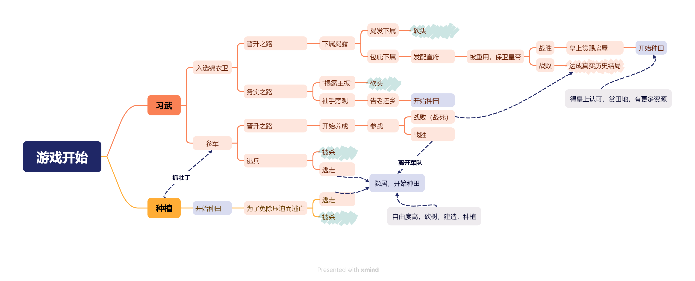

# 《明途》游戏设定总纲与历史考究

## 一、游戏简介

### 1.游戏名称

**《明途》**

> **副标题**：从一个普通边民的视角，沉浸体验明帝国的世界。

### 2.游戏类型
```tex
#独立 #角色扮演 #模拟 #历史 #农场模拟 #像素图形 #沙盒 #休闲 #生活模拟 #策略 #养成
```
### 3.游戏简介
#### （1）游戏简介

**发行日期**：2028年10月3日（预计）

**发行商**：伏龙游戏工作室 Crouching Dragon Game

**开发商**：伏龙游戏工作室 Crouching Dragon Game
#### （2）关于游戏

**欢迎来到《明途》！**

《明途》是**一款以真实历史为内核的多结局开放世界生活模拟RPG**，在游戏中，你扮演了一位**出生在边关**的普通明朝百姓，在时代的浪潮中成长。而在这个封建的时代将如何做出选择、身处农业发达的国家又该如何生存。剧情和情节均来自**真实历史事件**，你将有机会体验**仁宣之治**的国家兴盛、**瓦剌崛起**的边境摩擦、**郑和远航**的最后篇章以及**土木之变**的无奈抉择……

游戏提供了两种不同的玩法，通过自己的选择：

- 走上军旅之路，参与“**土木堡之变**”、“**北京保卫战**”等历史事件，感受历史，体验时代洪流
- 或归隐田园，经营农耕，体验五百多年前的农耕生活，见证乱世中的烟火人间

两条路径均可通向不同结局，最终影响个人命运与历史走向。

------

## 二、时代背景

> 📅 时间设定：从永乐二十一年（1423年）至弘治元年（1488年）

### 1.关键历史节点

| 年份          | 历史事件                | 游戏表现                       |
| ----------- | ------------------- | -------------------------- |
| **1423年**   | 永乐二十一年，主角诞生         | 游戏开局，主角出生                  |
| **1448年**   | **王振**专权达顶峰，边备废弛    | 主角少年时期，可选择习武或者种田           |
| **1449年7月** | 王振怂恿英宗**御驾亲征瓦剌**    | 主角可参军、逃兵、或种田避世             |
| **1449年8月** | **土木堡之变**：明军惨败，英宗被俘 | 军旅线高潮事件                    |
| **1449年9月** | 于谦拥立景泰帝，主持**北京保卫战** | 可参与守城战役                    |
| **1450年**   | 英宗被释归京，软禁南宫         | 效忠哪一位皇帝？                   |
| **1457年**   | **夺门之变**，明英宗复位      | 是否参与**夺门之变**               |
| **1457年后**  | 明英宗复辟时期             | 玩家选择是否隐居或者辞官               |
| **1488年前**  | 明朝中期                | 玩家的辞官种植线反映民间动荡，隐居线进行休闲娱乐玩法 |

### 2.具体剧情线


------

## 三、主角设定

### 1.主角档案

| 郑浩档案                              |
| --------------------------------- |
| **姓名**：郑浩（可改名）                    |
| **出身**：宣府官员之子，父母出生前就离世，由叔父抚养      |
| **初始身份**：边民孤儿                     |
| **出生日期**：永乐二十一年（1423年）十一月初七       |
| **成长方式**：玩家养成，根据玩家选择，可增加或减少不同的数值点 |
| **核心目标**：在乱世中生存，并决定自己的命运          |

> **无固定职业**：玩家可自由选择发展方向。

### 2.主角前传——郑远之死

| 郑远档案                                                                                                                                                                                                                                                                                                                                                                                                                                                                                                                                                                       |
| -------------------------------------------------------------------------------------------------------------------------------------------------------------------------------------------------------------------------------------------------------------------------------------------------------------------------------------------------------------------------------------------------------------------------------------------------------------------------------------------------------------------------------------------------------------------------- |
| **姓名**：郑远                                                                                                                                                                                                                                                                                                                                                                                                                                                                                                                                                                  |
| **字**：牧山                                                                                                                                                                                                                                                                                                                                                                                                                                                                                                                                                                   |
| **原官职**：锦衣卫南镇抚司校尉（正七品）                                                                                                                                                                                                                                                                                                                                                                                                                                                                                                                                                     |
| **生卒年份**：洪武二十四年（1393年）—永乐二十年（1422年）                                                                                                                                                                                                                                                                                                                                                                                                                                                                                                                                        |
| **传记**：郑远，字牧山，原为锦衣卫南镇抚司校尉，掌刑狱文书、案卷稽查。虽职卑而权实，常随千户查办军中贪弊、勾结逆党等要案。永乐十五年，郑远奉命协查一桩京营军官私卖军马案。他在整理旧档时，发现涉案军官曾与数名建文旧臣后人暗中往来，书信中提及“先帝遗志”“宗庙未复”等语。郑远依法将证据呈报上司，岂料该军官背后有内廷宦官撑腰，反被诬指“勾结建文余党，图谋不轨”。时值永乐帝晚年，对“靖难遗孤”极为敏感。虽无实据，但监军太监**马靖**得知郑远祖上曾在**建文年间任州吏**（仅为从九品杂职），便密奏：“**郑远身为亲军，不思效忠，反借查案之名，搜罗先朝遗事，私录逆书，其心可诛！此乃建文余党潜伏宫禁之明证！**”朱棣**未加详查**，怒令锦衣卫将其革职下狱。郑远在诏狱中受酷刑，拒不认罪，终死于永乐二十年秋，年三十。家属受连坐之律，**贬为军户，发配宣府边屯，世代不得脱籍**。其妻怀胎数月，跋涉千里，风雪中产子于宣府军屯村中。婴儿落地，啼声如刃，划破寒夜。永乐二十二年，成祖于漠北驾崩，仁宗朱高炽即位。洪熙元年春，仁宗下诏：“**建文诸臣，因忠获罪者，悉赦之；家属在边卫充军者，皆复其家。**”天下称颂，谓之“**仁宣之始**”。郑远之冤案亦在平反之列。朝廷追复其官，赐祭葬，子孙可**荫补锦衣卫舍人**。 |

------

## 四、剧情线铺设

### 1. 路径一：**军旅之路**

#### （1）成长阶段

| 阶段                  | 内容                                                 | 史实依据                 |
| --------------------- | ---------------------------------------------------- | ------------------------ |
| **1. 习武或被抓壮丁** | 被征入伍，成为普通士卒                               | 明代“垛集法”征兵制       |
| **2. 锦衣卫/边军**    | 选择加入锦衣卫或边军                                 | 锦衣卫有“亲军”职能       |
| **3. 晋升体系**       | 校尉→总旗 → 百户 → 千户（需战功）                    | 明代卫所军官晋升制       |
| **4. 土木堡之变**     | 随征后得知必定兵败后可选择保护皇帝或逃走             | 历史事件分支             |
| **5. 北京保卫战**     | 若在土木堡之变种幸存，回京城禀报后，可参与北京保卫战 | 于谦指挥，杨洪、郭登驰援 |

#### （2）特色玩法

- 战场指挥（小规模排兵）
- 锦衣卫办案（侦缉、刑讯）
- 功勋系统（影响官职与结局）
- 忠诚选择（效忠英宗或是代宗）

------

### 2. 路径二：**种植之路**

#### （1）成长阶段

| 阶段            | 内容                   | 史实依据             |
| --------------- | ---------------------- | -------------------- |
| **1. 开荒种地** | 在山林间开垦荒地       | 明代流民常“占山为业” |
| **2. 种植作物** | 种植符合北方气候的作物 | 见下表               |
| **3. 自给自足** | 养鸡、养猪、酿酒、织布 | 明代农村经济形态     |
| **4. 市集交易** | 用实物或货币买卖       | 明代民间贸易         |
| **5. 建造家园** | 盖房、设仓、修篱       | 农耕文明象征         |

#### （2）特色玩法

- 季节系统（春播秋收）
- 传统历法及节气（在特殊速度下，游戏进程按照二十四节气和农历推进）
- 天气影响（旱涝虫灾等自然灾害有概率发生）
- 农具升级（犁、镰、水车）
- 村落建设（可发展成庄园）

> 具体内容参考下文农业系统

---

## 五、宣府镇历史考究

> 游戏背景中主角出身时的地点，明朝九边重镇之一的宣府镇

### 1. 宣府镇：九边重镇的核心战略地位

#### 地理定位与军事价值

| 项目         | 详述                                                         |
| ------------ | ------------------------------------------------------------ |
| **地理位置** | 今河北省张家口市宣化区，长城内侧（关外），扼守北京西北门户，北接蒙古草原，西控大同，东连蓟州 |
| **战略意义** | 1. **京师屏障**：距北京200里，为“京师锁钥”<br> 2. **九边枢纽**：九边（辽东、蓟州、宣府、大同、太原、延绥、宁夏、固原、甘肃）中唯一直通京师的重镇<br> 3. **贸易通道**：茶马互市核心（张家口堡为后期发展） |
| **防御体系** | 长城防线（23座关隘）、200余座墩台、军屯村落（12万亩耕地）、马政系统（每卫养马500匹） |

> 📜 **史料依据**：《明史·兵志》载：“宣府为京师西北门户，控扼蒙古入犯要道，九边之中，宣府最重。”

------

### 2. 宣府行政与军事体制（1420-1450年）

#### （1） 三级军政架构（核心权力体系）

```text
皇帝（北京）  
│
├─ 司礼监（内廷）  
│    └─ 通过“传奉”指令锦衣卫、总兵官  
│
└─ 宣府镇（地方）  
     ├─ 总兵官（正二品，驻宣化城）  
     │    ├─ 万全右卫（驻万全）  
     │    ├─ 怀安卫（驻怀安）  
     │    └─ 宣府卫（驻宣化）  
     │
     ├─ 巡抚（都察院右佥都御史，正三品）  
     │    └─ 监督军政、管理赋税、协调粮饷  
     │
     └─ 兵备道（副使，从四品）  
          └─ 专责边防、墩台、军屯、马政
```


#### （2）军屯制度运作（核心经济基础）

| 项目         | 详述                                        | 史实依据                                            |
| ------------ | ------------------------------------------- | --------------------------------------------------- |
| **军田分配** | 每户军户分田30亩（含10亩“官田”+20亩“屯田”） | 《明会典·卷二十一》：“军户屯田，每户授田三十亩”     |
| **军粮自给** | 军户需上缴“军粮”：每户年缴粟1石（约100斤）  | 《明实录·永乐二十一年》：“宣府军户岁输粟，以充边饷” |
| **军户世袭** | 从永乐朝起，军籍“父子相继，不得脱籍”        | 《大明律·户律》：“军户子孙，世袭军籍，不得为民”     |
| **军屯规模** | 宣府镇军屯覆盖12万亩耕地，占总耕地67%       | 《宣府镇志·食货志》：“军屯田地，十居其七”           |

> ⚠️ **关键限制**：军户不得经商、不得科举，违者罚为“贱籍”（如奴婢）。

------

### 3. 宣府城（今宣化区）街道与建筑布局

#### （1）城池格局

| 项目         | 详述                                                         | 游戏化设计建议                                           |
| ------------ | ------------------------------------------------------------ | -------------------------------------------------------- |
| **城墙**     | 周长12里，高15丈（约45米），厚2丈（6米） 四门：东“迎恩门”、西“宣武门”、南“宣化门”、北“德胜门” 每门设瓮城（防御箭矢/骑兵冲击） | ✅ 主城门设瓮城，玩家需通过“瓮城”进入城内                 |
| **街道**     | “井”字形主干道： - 南北轴：南门→鼓楼→总兵府→北门 - 东西轴：东门→鼓楼→巡抚衙门→西门 | ✅ 主干道宽5-7米，铺条石；坊巷窄至2米，适合潜行任务       |
| **功能分区** | 1. **行政军事区**（城北）：总兵府、兵备道、校场 2. **市集区**（鼓楼周边）：商铺、酒肆、茶馆 3. **居民区**（城南/西）：军户四合院、民户排房 4. **宗教区**：昭化寺（城中）、城隍庙（西门） | ✅ 校场设“点兵”任务；市集设“交易系统”；昭化寺藏“军情密信” |

> 据**《宣府镇志》卷一**总结

#### （2）重要建筑详述

| 建筑         | 位置       | 功能                 | 历史细节                                                     |
| ------------ | ---------- | -------------------- | ------------------------------------------------------------ |
| **总兵府**   | 城北中心   | 最高军事指挥机构     | 1. 建筑规格：三进院落，正殿悬“镇朔”匾 2. 重要事件：1449年于谦调兵于此 |
| **巡抚衙门** | 城东鼓楼旁 | 行政监察、管理赋税   | 1. 与兵备道合署办公 2. 1425年仁宗平反建文旧案后，此处为“平反案卷”存放地 |
| **校场**     | 城北校场街 | 军队训练、点兵、比武 | 1. 面积：50亩（约3.3万平方米） 2. 设施：靶场、演武台、马厩 3. 《明实录》载：“宣府校场，每岁三练” |
| **昭化寺**   | 城中       | 军民共祭、藏经阁     | 1. 始建于永乐年间，明成祖赐名 2. 寺内藏“边军布防图”（可触发任务） |
| **宣府仓**   | 城西       | 存储军粮、赈灾粮     | 1. 仓廒100间，可储粮10万石 2. 1448年王振贪墨导致粮仓空虚     |

> 📜 **《宣府镇志》卷二**：“城中街道，以鼓楼为心，南北东西，四达通衢。市肆皆在鼓楼左右，军营则环城而列。”

------

### 4.军屯村落：边关军户的真实生活

#### （1）军屯村落布局（基于考古报告）

```text
[围墙]  ← 1.5丈高夯土墙，无城门，仅设瞭望台
│
├─ [粮仓]  ← 3间土仓，存军粮
├─ [兵房]  ← 10户军户，每户2间茅草屋（砖木结构）
├─ [马厩]  ← 2间，养马10匹（军户配额）
├─ [铁匠铺] ← 1间，军户自造农具/兵器
└─ [水井]  ← 1口，供全村饮用
```

#### （2）军户生活全息考据

| 生活维度   | 详述                                                        | 游戏机制               |
| ------ | --------------------------------------------------------- | ------------------ |
| **居住** | 1. 茅草顶+夯土墙，单层 2. 5-6人一户，五世同堂常见 3. 厨房设灶膛（余烬过夜）             | ✅ 住宅可升级（如加砖墙）      |
| **耕作** | 1. 作物：粟（小米）为主，配种小麦、高粱 2. 工具：犁、耧车、锄、镰 3. 农时：春播（3月）→ 秋收（9月） | ✅ 季节系统：春耕/夏耘/秋收/冬藏 |
| **饮食** | 1. 主食：小米粥+窝头 2. 副食：腌萝卜+豆酱 3. 年节：饺子（春节）、月饼（中秋）             | ✅ 每日三餐：早粥/午饭/晚饭    |
| **服饰** | 1. 男子：短褐+麻布裤 2. 女子：交领短衫+马面裙 3. 禁用：红/黄/龙纹、丝绸、皮靴            | ✅ 服饰系统：军户装束不可变     |
| **娱乐** | 1. 春节：舞狮、听《水浒传》说书 2. 清明：踏青、扫墓 3. 冬季：围炉夜话                  | ✅ 节日事件：清明祭祖、中秋赏月   |

> ❌ **禁止错误**：
> \- 军户穿长衫（明代平民穿短褐）
> \- 女子穿唐代襦裙（明代为马面裙）
> \- 村落有城门（军屯无门，仅围墙）

------

### 5. 周边聚落与交通网络

#### （1）宣府周边核心聚落

| 聚落名称        | 位置     | 功能                     | 特色                       |
| --------------- | -------- | ------------------------ | -------------------------- |
| **万全右卫城**  | 东15里   | 军事卫城，与宣府互为犄角 | 城墙高12丈，驻军8000人     |
| **怀安城**      | 西20里   | 农业重镇，粮仓集散地     | 产小麦，设“怀安仓”         |
| **张家口堡**    | 东30里   | 茶马互市（明后期兴起）   | 1450年后设“张家口马市”     |
| **蔚州**        | 东北50里 | 文化中心，书院聚集       | 有“蔚州书院”，培养军户子弟 |
| **墩台/烽火台** | 长城沿线 | 军事警戒系统             | 每10里设墩台，30里设城堡   |

#### （2）交通与物流

| 项目       | 详述                                | 游戏应用                       |
| ---------- | ----------------------------------- | ------------------------------ |
| **主干道** | 宣化→北京（官道）：200里，需3天行程 | ✅ 玩家可选择“走官道”或“抄小路” |
| **驿站**   | 宣府驿（城西）、张家口驿（东）      | ✅ 驿站提供马匹、情报           |
| **水路**   | 洋河（宣化城西）：运粮、运铁        | ✅ 河边设“渡口”交易点           |
| **马政**   | 每卫养马500匹，马政司监管           | ✅ 军屯可养马（提升行军速度）   |

> 📜 **《明会典·卷二十二》**：“宣府马政，每卫养马五百匹，岁课孳息。”

------

### 6. 游戏场景设计关键细节

#### （1）宣府城街道动态系统

| 时段                | 场景                             | 交互设计                       |
| ------------------- | -------------------------------- | ------------------------------ |
| **卯时（5-7点）**   | 军户出户耕作，市集摊贩摆摊       | 玩家可“购买种子”“雇佣农夫”     |
| **午时（11-13点）** | 校场点兵，巡抚衙门议事           | 触发“军务任务”（如“押送粮草”） |
| **酉时（17-19点）** | 市集收摊，更夫巡街               | 触发“暗杀/情报交易”事件        |
| **亥时（21-23点）** | 鼓楼报更（“天干物燥，小心火烛”） | 玩家需“守夜”避免火灾           |

#### （2）军屯村落动态事件

| 事件类型           | 触发条件             | 历史依据                                        |
| ------------------ | -------------------- | ----------------------------------------------- |
| **军粮短缺**       | 秋收后粮仓空虚       | 《明实录·正统十三年》：“宣府军粮不继，士卒饥馁” |
| **蒙古小股袭扰**   | 月圆夜（农历十五）   | 《明史·土木堡之变》：“瓦剌常于月夜袭边”         |
| **军户子弟考武举** | 玩家军旅线达到“百户” | 《明会典·武举》：“军户子可应武举”               |
| **平反建文旧案**   | 仁宗即位（1425年）   | 《明史·仁宗本纪》：“诏释建文旧臣家属”           |

#### （3）禁用错误清单（游戏开发红线）

| 错误内容           | 正确考据         | 依据                                      |
| ------------------ | ---------------- | ----------------------------------------- |
| 军户穿长衫         | 军户穿短褐       | 《大明衣冠》：“军户短褐，不得长衫”        |
| 玉米/土豆出现      | 1450年未传入中国 | 《明史·食货志》：“玉米、土豆，万历后始入” |
| 锦衣卫日常穿飞鱼服 | 仅赐服，非日常   | 《明史·职官志》：“飞鱼服，赐服也，非常服” |
| 女子穿旗装         | 清代才出现       | 《清代通典》：“旗装始于清初”              |
| 军户可随意脱籍     | 世袭军籍，不可脱 | 《大明律·户律》：“军籍子孙，世袭不脱”     |

------

## 六、农业及畜牧业系统

### 1. 农业生产方式

**总体特征**：明代农业承袭宋元制度，以**小农经济**为主，实行**精耕细作**，强调“**因地制宜、因时制宜**”。
北方以**旱作农业**为主（粟、麦、高粱），南方以**水稻种植**为主，江南地区已形成“**稻麦轮作**”体系。

------

### 2. 可种植农作物种类

#### （1）粮食作物

| 作物 | 学名/别称      | 主要种植区域           | 史料依据                                                   |
| ---- | -------------- | ---------------------- | ---------------------------------------------------------- |
| 水稻 | 稻、粳稻、糯稻 | 江南、湖广、四川       | 《天工开物·乃粒》：“凡稻种最多……不粘者为粳，粘者为糯。”    |
| 小麦 | 麦、大麦、小麦 | 华北、西北、黄淮流域   | 《明史·食货志》：“北土宜麦，民以面食为主。”                |
| 粟   | 小米、谷子     | 华北、西北、宣府等边镇 | 《天工开物》：“粟为五谷之长，北地所重。”                   |
| 高粱 | 菽、蜀黍       | 北方干旱地区           | 《农政全书》（后出，但反映前期实践）：“蜀黍宜沙地，耐旱。” |
| 大豆 | 黄豆、菽       | 全国普遍种植           | 《天工开物》：“豆为五谷之辅，可食可肥田。”                 |
| 绿豆 | 青小豆         | 华北、江南             | 民间广泛种植，用于制粉、煮粥                               |

> ✅ **特点**：实行轮作制（如麦后种豆），北方“粟麦轮作”，南方“稻麦两熟”初现。

---

#### （2）经济作物

经济作物广泛种植，推动商品经济发展，形成区域专业化生产。

| 作物 | 用途       | 主要产区                   | 史料依据                                          |
| ---- | ---------- | -------------------------- | ------------------------------------------------- |
| 棉花 | 纺纱织布   | 江南（松江府）、河南、河北 | 《明史·食货志》：“棉布寸土皆有，织机十室九有。”   |
| 桑树 | 养蚕缫丝   | 江南（苏州、杭州）、四川   | 《天工开物·乃服》：“茧绸出嘉、湖，绫罗产苏、杭。” |
| 茶树 | 制茶       | 福建、浙江、安徽、四川     | 《明会典》：“天下产茶之地，岁办茶课。”            |
| 麻   | 制绳、织布 | 北方农村                   | 《便民图纂》：“苎麻种于屋旁，夏采秋织。”          |
| 甘蔗 | 制糖       | 福建、广东、四川           | 《天工开物》：“糖车榨蔗，南人嗜之。”              |

> ✅ **特点**：江南“桑基鱼塘”生态农业初现，棉纺织业高度商品化。

---

#### （3）蔬菜种类

蔬菜种植多样化，以本土品种为主，部分来自西域，多为应季种植。

| 蔬菜 | 别名/学名      | 种植情况                 | 史料依据                                     |
| ---- | -------------- | ------------------------ | -------------------------------------------- |
| 白菜 | 芥菜、菘       | 南北普遍，冬季主菜       | 《本草纲目》（后出）：“菘即白菜，南北通有。” |
| 萝卜 | 菜菔、芦菔     | 全国广泛种植             | 《便民图纂》：“萝卜秋种冬收，可腌可食。”     |
| 葱   | 青葱、胡葱     | 房前屋后，常年可种       | 《天工开物》：“五荤之一，家家必备。”         |
| 姜   | 生姜           | 南方为主，北方窖藏       | 《本草纲目》：“姜，南人多食。”               |
| 蒜   | 大蒜、胡蒜     | 普遍种植，驱疫用         | 《明实录》：“民间食蒜以避瘟。”               |
| 芹菜 | 水芹、旱芹     | 水边或菜园               | 《农政全书》：“芹生水际，春采为佳。”         |
| 菠菜 | 波棱菜、波斯菜 | 明初传入，宫廷与城市种植 | 《本草纲目》：“波棱菜，西域种，唐时入中国。” |
| 胡瓜 | 黄瓜           | 夏季常见                 | 《便民图纂》：“胡瓜夏熟，生食为佳。”         |
| 茄子 | 落苏           | 南方为主                 | 《天工开物》：“茄种出南方，今北地亦有。”     |
| 豆角 | 菜豆、四季豆   | 夏季种植                 | 民间广泛种植，干豆可储                       |

> ⚠️ **注意**：
>
> - **番茄、辣椒、玉米、土豆、花生**：均未传入中国，**明朝中期不存在**。
> - **洋葱、西葫芦、生菜**：尚未普及，非主流蔬菜。

---

#### （4）水果种类

水果以温带和亚热带为主，多为庭院种植或山野采集，部分进贡宫廷。

| 水果 | 别名/学名  | 主要产区         | 史料依据                               |
| ---- | ---------- | ---------------- | -------------------------------------- |
| 桃   | 桃子       | 全国普遍         | 《天工开物》：“桃李满园，春华秋实。”   |
| 李   | 李子       | 南北皆有         | 《便民图纂》：“李树易活，夏初可食。”   |
| 梨   | 雪梨、沙梨 | 山东、河北、江南 | 《明史》：“莱阳梨，贡品也。”           |
| 枣   | 红枣、冬枣 | 华北、山西       | 《天工开物》：“北土枣栗，民食所资。”   |
| 栗   | 板栗       | 河北、江南       | “糖炒栗子”已为市井小吃                 |
| 柿子 | 柿饼       | 河北、河南、陕西 | 《本草纲目》：“柿霜可入药。”           |
| 柑橘 | 橘、橙、柚 | 湖广、江西、四川 | 《广志》：“荆州橘柚，岁贡朝廷。”       |
| 葡萄 | 蒲桃       | 宫廷、寺院种植   | 《明实录》：“西域贡葡萄，植于御园。”   |
| 杏   | 杏子       | 北方为主         | 《便民图纂》：“杏熟于夏初，可制杏仁。” |
| 樱桃 | 含桃       | 北京、南京御园   | 《明宫史》：“樱桃熟，赐百官。”         |
| 枇杷 | 卢橘       | 江南、福建       | 《本草纲目》：“枇杷出闽广，止咳佳品。” |
| 桑葚 | 桑实       | 桑园附带收获     | 养蚕区常见，民间食用                   |

> ⚠️ **注意**：
>
> - **西瓜**：已传入，元代已有种植，明朝中期常见于夏季。
> - **香蕉、菠萝、芒果、草莓**：尚未传入，**不存在**。
> - **苹果**：明代称“柰”或“林檎”，为小果型，非现代苹果。

---

#### （5） **不可有（尚未传入或未普及）**

| 作物               | 说明                                                 |
| ------------------ | ---------------------------------------------------- |
| **玉米**           | 嘉靖以后才由美洲经东南亚传入，明中期**绝对不存在**。 |
| **土豆（马铃薯）** | 万历年间才传入，明中期**不存在**。                   |
| **红薯（甘薯）**   | 万历年间由吕宋传入，明中期**不存在**。               |
| **花生**           | 嘉靖以后传入，明中期**不存在**。                     |
| **辣椒**           | 明末传入，明中期调味用**花椒、姜、茱萸**。           |
| **烟草**           | 万历以后传入，明中期**不存在**。                     |

### 3. 主要作物种植方式（以小麦为例）

#### （1）**小麦种植全过程**

| 阶段        | 具体做法                                                     | 所用工具                                   | 备注                                   |
| ----------- | :----------------------------------------------------------- | ------------------------------------------ | -------------------------------------- |
| **1.选种**  | 选取颗粒饱满、无虫蛀的麦粒，晒干储存。                       | 篮、簸箕                                   | “择其大者为种，小者食之”——《便民图纂》 |
| **2.整地**  | 秋收后翻耕土地，深约6–8寸，碎土平田，清除杂草。              | **犁**（牛耕）、**耙**、**耰**（平整工具） | 北方多“秋耕冬耙，春耖”                 |
| **3.施肥**  | 播种前施基肥，以**人粪尿、牲畜粪、草木灰、绿肥**为主。       | 粪桶、粪勺                                 | “粪田之美者，莫如人粪”——《天工开物》   |
| **4.播种**  | **条播**为主，用**耧车**（三脚耧）开沟播种，行距约6–8寸，深度1–2寸。 | **耧车**、**锄**                           | 冬小麦在**秋分至寒露**间播种           |
| **5.中耕**  | 出苗后锄草、松土，防止板结。                                 | **锄**、**耰**                             | “三耘”（三次中耕）为常制               |
| **6.灌溉**  | 依赖雨水，干旱时引河、井水灌溉，南方有陂塘蓄水。             | 桶、桔槔（杠杆提水）、辘轳                 | 北方多“靠天收”，南方水利较发达         |
| **7.收获**  | 麦熟时用**镰刀**收割，捆成束，运至场院。                     | **镰**、**担**                             | “刈麦”在**小满至芒种**间               |
| **8.打场**  | 在**场院**（打谷场）用**连枷**或牛踩踏脱粒。                 | **连枷**、**石磙**、**牛**                 | “打麦场”为夏收重要场景                 |
| **9.扬场**  | 利用风力，用**木锨**抛起麦粒，糠秕被风吹走。                 | **木锨**、**扫帚**                         | “扬场看风向”                           |
| **10.入仓** | 晒干后入仓，防潮、防鼠。                                     | **仓廪**（粮仓）                           | 官仓称“常平仓”，民仓称“谷囤”           |

------

#### （2） 肥料使用

| 肥料类型   | 来源             | 使用方式                 | 文献记载                           |
| ---------- | ---------------- | ------------------------ | ---------------------------------- |
| **人粪尿** | 人类排泄物       | 晒干成“粪干”或发酵后施用 | 《天工开物》：“粪田之肥，人粪为上” |
| **牲畜粪** | 牛、猪、羊、马粪 | 混合秸秆堆肥后施用       | “牛粪肥田，其力最厚”——《农政全书》 |
| **草木灰** | 灶灰、烧荒灰     | 撒于田中，补钾           | “灰能杀虫，又能肥土”               |
| **绿肥**   | 豆类、苜蓿、水草 | 翻压入土，腐熟成肥       | 南方水稻田常用                     |
| **河泥**   | 河底淤泥         | 挖取后晒干施用           | 江南地区常见                       |
| **蚕沙**   | 蚕粪             | 混合其他肥使用           | 桑蚕区特有                         |

> ⚠️ **禁用**：明代**无化学肥料**，如尿素、磷肥等。

------

### 4. 农业生产工具

| 工具     | 用途         | 材质         | 文献出处                                     |
| -------- | ------------ | ------------ | -------------------------------------------- |
| **犁**   | 翻土         | 木架+铁铧    | 《天工开物》有图                             |
| **耙**   | 碎土、平田   | 木架+铁齿    | “耕耙耖”三步                                 |
| **耧车** | 播种（条播） | 木制，三脚   | “一牛挽之，一人执耧，且行且摇”——《农政全书》 |
| **锄**   | 中耕、除草   | 铁刃+木柄    | 每家必备                                     |
| **镰**   | 收割         | 铁刃+木柄    | 弧形刃，利于割麦                             |
| **连枷** | 脱粒         | 两根木棍铰接 | “打麦连枷声”                                 |
| **石磙** | 压场、脱粒   | 圆柱形石制   | 牛拉或人推                                   |
| **木锨** | 扬场         | 木制宽铲     | 抛扬谷物                                     |
| **桔槔** | 提水         | 杠杆原理     | “井上架木，悬桶取水”                         |
| **辘轳** | 深井提水     | 轮轴装置     | 城市、深井用                                 |

------

### 5. 畜牧业生产方式

| 家畜           | 饲养方式                                                     | 饲料                 | 备注                                 |
| -------------- | ------------------------------------------------------------ | -------------------- | ------------------------------------ |
| **牛**         | 多为**役用**（耕田、拉车），严禁私杀，老弱病残经官府批准方可宰杀。 | 草、秸秆、豆渣       | “牛为农本，私宰者杖一百”——《大明律》 |
| **猪**         | 农户散养，圈养为主，以**黑猪**为主，体型小。                 | 剩饭、糠、野菜、泔水 | “家有肥猪，岁终可宰”                 |
| **羊**         | 北方多见，放牧或圈养。                                       | 草、秸秆             | 用于肉、皮、毛                       |
| **鸡、鸭、鹅** | 农户自养，自由觅食，补喂谷物。                               | 谷糠、剩饭、虫草     | “鸡栖于埘，犬栖于窦”                 |

------

### 6. 牲畜宰杀制度与方式

#### （1）宰杀权限与执行者

| 家畜类型       | 是否可私宰     | 由谁宰杀                       | 法律依据                              |
| -------------- | -------------- | ------------------------------ | ------------------------------------- |
| **牛**         | ❌ **严禁私宰** | 官府批准后，由**专职屠夫**宰杀 | 《大明律·户律》：“私宰牛马者，杖一百” |
| **马、骡、驴** | ❌ 严禁私宰     | 官府或军营指定屠夫             | 军用牲畜，管理严格                    |
| **猪**         | ✅ 可宰（自用） | **农户自宰** 或请**屠夫**      | “岁终宰牲祭祖”常见                    |
| **羊**         | ✅ 可宰         | 农户或屠夫                     | 北方多由屠夫处理                      |
| **鸡、鸭、鹅** | ✅ 可宰         | **农户自宰**                   | 家庭日常行为，无需屠夫                |

> 📌 **屠夫（屠户）**：  
>
> - 专业屠宰者，多为男性，属“**下九流**”之一。  
> - 有专用工具：**屠刀、血盆、刮毛刀、吊架**。  
> - 屠宰大型牲畜（猪、羊）需一定技巧，故农户常请屠夫。

------

#### （2）宰杀方式

| 家畜       | 宰杀方式                     | 处理流程                                                     |
| ---------- | ---------------------------- | ------------------------------------------------------------ |
| **猪**     | **刺喉放血**或**击晕后割喉** | 1. 绑缚四蹄 2. 刺喉放血 3. 烫水去毛（用沸水浇烫） 4. 开膛取内脏 5. 分割 |
| **羊**     | 割喉放血                     | 类似猪，但体型小，操作较易                                   |
| **牛**     | 官府监督下割喉               | 严禁活剥、虐杀，须快速致死                                   |
| **鸡**     | **断颈**或**割喉**           | 手持鸡翅，刀割颈部血管，放血后烫水拔毛                       |
| **鸭、鹅** | 同鸡                         | 烫水后拔毛，注意羽绒收集                                     |

> 📚  据《本草纲目》《便民图纂》
>
> 📚 《本草纲目·兽部》载：“猪，畜之以食，宰之以时，取其肉、脂、脏、血，各有所用。”

------

### 7. 总结：明代农耕与畜牧核心特点

| 方面         | 特点                                         |
| ------------ | -------------------------------------------- |
| **农业模式** | 小农经济，精耕细作，南北差异明显             |
| **耕作技术** | 耕—耙—耖—播—耘—收，系统化流程                |
| **肥料来源** | 人畜粪、草木灰、绿肥，**无化学肥**           |
| **工具水平** | 铁器普及，但机械化程度低，依赖人力、畜力     |
| **畜牧管理** | 牛马受法律保护，严禁私宰；猪禽可自宰         |
| **屠宰分工** | 大型牲畜由**屠夫**处理，家禽**农户自宰**     |
| **生态循环** | “**种养结合**”：粪肥田，田养畜，形成闭合循环 |

> 📜 **《天工开物》总结**：
> “**生人不能久生而五谷生之，五谷不能自生而生人生之。**”
> ——强调人类通过农耕维系生存，农业为立国之本。

------

## 七、货币与经济系统

### 1.官方货币体系

明朝中期实行“**钱钞并行、白银渐起**”的复合货币制度，但宝钞严重贬值，铜钱与白银成为实际流通主力。

#### （1）主要货币类型

| 货币类型 | 名称与特征                                                   | 官方地位                             | 实际流通情况                               |
| -------- | ------------------------------------------------------------ | ------------------------------------ | ------------------------------------------ |
| **纸币** | **大明宝钞** - 洪武八年（1375）发行 - 面额：一贯、五百文、四百文……至十文 - 无准备金，不可兑换 | 法定主币，强制流通                   | 永乐后严重贬值，正统年间已基本退出民间交易 |
| **铜钱** | **永乐通宝** - 永乐六年（1408）开铸 - 小平钱，重一钱 - 铜质精良，文字工整 | 合法辅币，官方铸造                   | 广泛用于小额交易，市井日用                 |
| **白银** | **银锭/碎银** - 重量单位：两、钱、分 - 成色：纹银（93.5%纯度为标准） | 非正式货币，禁止民间使用（洪武禁令） | 实际已成为大额交易、赋税折纳的主要媒介     |

> 📜 **《明史·食货志》**：“钞法不行，民间但以银钱交易。”

------

#### （2） 货币政策演变

| 时间                  | 政策                            | 影响                           |
| --------------------- | ------------------------------- | ------------------------------ |
| 洪武八年（1375）      | 发行大明宝钞，禁用铜钱          | 强制推行纸币                   |
| 永乐六年（1408）      | 复开铸“永乐通宝”                | 恢复铜钱流通，缓解找零难题     |
| 宣德年间（1426–1435） | 宝钞贬值至面值1%                | 民间拒收宝钞，税收仍收宝钞     |
| 正统元年（1436）      | **金花银改革** 江南田赋折征白银 | 白银合法化开端，加速银本位形成 |

> ✅ **关键转折**：正统元年“金花银”改革是明代货币史分水岭，标志白银从“非法”走向“半合法”。

------

### 2. 民间经济系统

#### （3） 市场层级与交易形式

| 层级     | 名称                   | 特征                                         |
| -------- | ---------------------- | -------------------------------------------- |
| **基层** | 草市、墟市             | 农村定期集市，三日一集，交易粮食、布匹、农具 |
| **中级** | 县城、府城市场         | 固定商铺林立，有牙行（中介）、钱铺（兑换）   |
| **高级** | 南京、苏州、杭州、北京 | 全国性商业中心，手工业行会发达               |

> 📌 **交易方式**：
>
> - 小额：铜钱（文）
> - 中额：碎银（钱、两）
> - 大额：银锭（五十两“元宝”用于大宗交易）

------

#### （4）主要经济活动

| 行业         | 特征与代表                                                   |
| ------------ | ------------------------------------------------------------ |
| **农业经济** | - 自给自足为主 - 军屯、民屯广泛 - 江南已出现“佃农—地主”租佃制 |
| **手工业**   | - 官营：织造局（南京、苏州）、铸钱局 - 民营：棉纺（松江）、陶瓷（景德镇）、造纸（徽州）、冶铁（佛山） |
| **商业贸易** | - 区域贸易：南粮北运、北马南贩 - 长途贩运：徽商、晋商崛起 - 城市行会：各业有“行头”，管理价格与质量 |

------

#### （5）货币兑换与金融服务

| 机构       | 功能                                                       |
| ---------- | ---------------------------------------------------------- |
| **钱铺**   | - 铜钱与白银兑换 - 鉴定银色、称重（用戥子） - 提供小额借贷 |
| **当铺**   | - 抵押借贷，利率较高（月息3–5%） - 接受衣物、家具、田契    |
| **银匠铺** | - 熔铸碎银为标准银锭 - 鉴定成色，出具“银票”（非银行券）    |

> 📏 **称重工具**：
>
> - **戥子**：精密小秤，用于称银，单位“两、钱、分”
> - **标准**：1两 = 10钱 = 100分 ≈ 37.3克

------

### 3. 物价水平（以正统年间为例）

| 商品         | 价格                      | 备注               |
| ------------ | ------------------------- | ------------------ |
| **米价**     | 1石（约60公斤） ≈ 1两白银 | 丰年略低，荒年暴涨 |
| **布匹**     | 1匹棉布 ≈ 300–500文铜钱   | 松江布畅销全国     |
| **猪肉**     | 1斤 ≈ 10–20文             | 市井常见肉食       |
| **役夫日薪** | 约 20–50文                | 农闲时打短工       |
| **秀才束脩** | 一年 ≈ 1–2两白银          | 教师薪酬           |
| **房屋**     | 县城小院 ≈ 20–50两        | 地价差异大         |

> 📉 **宝钞购买力对比**：
>
> - 洪武年间：1贯宝钞 = 1000文 = 1两银
> - 正统年间：1贯宝钞 ≈ 1–2文铜钱，近乎废纸

------

### 4. 税收与财政制度

| 项目     | 内容                                                         |
| -------- | ------------------------------------------------------------ |
| **田赋** | 原征米麦（本色） - 正统元年起，江南部分折征白银（金花银）    |
| **徭役** | 力役（亲身服役） - 银差（出银代役）渐多                      |
| **商税** | 抽分场（竹木）、钞关（水路）、门摊（市店） - 税率3–5%，多收宝钞 |
| **盐课** | 盐引制度，商人纳粮或银换引，专卖获利                         |

> ✅ **趋势**：赋役逐渐“**由实物向货币转化**”，为张居正“一条鞭法”奠定基础。

------

### 5. 禁止出现的经济错误（游戏开发红线）

| 错误内容           | 正确考据                     | 依据                   |
| ------------------ | ---------------------------- | ---------------------- |
| 宝钞广泛流通       | 正统年间宝钞已基本废用       | 《明史·食货志》        |
| 白银作为官方铸币   | 明代无银元，白银为称量货币   | 考古出土均为银锭、碎银 |
| 普通人使用金币     | 明代无流通金币，仅赏赐用     | 《明会典》             |
| 银行或钱庄发行纸币 | 无现代银行，仅有钱铺、当铺   | 明代金融史料           |
| 铜钱称“元宝”       | “元宝”专指银锭，铜钱称“通宝” | 《天工开物》           |

------

### 6. 总结：明朝中期经济系统核心特征

| 维度         | 真实情况                                   |
| ------------ | ------------------------------------------ |
| **货币制度** | 钱钞并行 → 银钱为主，宝钞名存实亡          |
| **白银地位** | 事实上的主币，但尚未完全合法化             |
| **市场结构** | 草市—县城—都会三级体系，行会管理           |
| **经济趋势** | 商品经济活跃，白银化、货币化加速           |
| **社会影响** | 商人地位提升，徽商、晋商崛起，城乡差距拉大 |

> ✅ **历史启示**：
> 明朝中期虽有“仁宣之治”的稳定，但货币体系已陷入“**宝钞崩溃、银贵钱贱**”的困境，民间经济依赖白银，为后期财政危机埋下伏笔。

------

## 八、社会制度与阶级结构

------

### 1. 社会制度总则

明朝社会以“**皇权至上、等级森严、重农抑商、宗法维系**”为核心，制度设计旨在维护中央集权与社会稳定。

| 原则             | 说明                                       |
| ---------------- | ------------------------------------------ |
| **户籍制度严格** | 民户、军户、匠户、灶户等世袭，不得随意变更 |
| **身份等级分明** | 士、农、工、商四民分业，官绅享有特权       |
| **宗法制度主导** | 家族为基本单位，族长掌管祭祀、财产、教育   |
| **科举取士为本** | 科举是平民上升唯一正途，维系“士”阶层再生   |

> 📜**《大明律·户律》**：“凡军、民、医、匠、阴阳诸色人户，并以原籍为定，不许妄行变乱。”

------

### 2. 主要社会阶级与身份群体

#### （1）皇室与宗藩

| 群体           | 地位与特权                               | 数量与负担               |
| -------------- | ---------------------------------------- | ------------------------ |
| **皇帝**       | 最高统治者，掌握立法、行政、司法、军事权 | 1人                      |
| **亲王**       | 皇子封王，居封地，有护卫军（后裁撤）     | 永乐后限制权力，不得干政 |
| **郡王及以下** | 世袭降等，俸禄由朝廷供给                 | 宗室人口膨胀，财政负担重 |

>  **特点**：宗藩不治民、不任官、不务工，仅享俸禄与田产。

------

#### （2）官绅阶层（士大夫）

| 等级           | 构成                     | 特权                                           |
| -------------- | ------------------------ | ---------------------------------------------- |
| **在职官员**   | 中央六部、地方知府至知县 | - 免役免税 - 司法特权（“八议”） - 社会地位尊崇 |
| **致仕官员**   | 退休官员                 | 保留部分特权，地方乡绅领袖                     |
| **生员、举人** | 未仕士人（秀才、举人）   | - 免役 - 见官不跪 - 可穿襕衫                   |

> 📚 **科举路径**：
> 童生 → 县试 → 府试 → 院试 → **生员（秀才）**
> ↓
> 乡试（省） → **举人**
> ↓
> 会试 + 殿试 → **进士**

>  **关键作用**：士人阶层是国家治理与地方秩序的实际维系者。

------

#### （3）民户（平民百姓）

| 类型     | 构成                   | 义务与生活                               |
| -------- | ---------------------- | ---------------------------------------- |
| **民户** | 普通农民、自耕农、佃农 | - 纳粮当差 - 承担里甲徭役 - 多半自给自足 |
| **军户** | 世代为兵，隶属卫所     | - 出丁当兵 - 耕种军屯田地 - 不得脱籍     |
| **匠户** | 手工业者，隶属工部     | - 轮班或住坐服役 - 可纳银代役（宣德后）  |
| **灶户** | 盐户，专事煮盐         | - 产盐上缴 - 生活艰苦，逃亡严重          |

> ⚠️ **户籍世袭**：一旦定籍，子孙不得更改，如军户逃亡将受严惩。

------

#### （4）特殊群体

| 群体           | 地位与特征                                                   |
| -------------- | ------------------------------------------------------------ |
| **商人**       | 地位最低，“士农工商”之末 - 禁穿丝绸、禁用金器 - 但实际财富积累快，徽商、晋商崛起 |
| **奴仆与婢女** | 法律上属“贱口”，但非奴隶制 - 可签契约，有一定权利 - 多为贫民卖身或战俘 |
| **僧道**       | 出家人，需度牒（官方许可证） - 可免徭役，但受严格管理        |
| **乐户、丐户** | 区域性贱籍，如山西乐户，社会歧视严重                         |

------

### 3. 基层社会组织：里甲与宗族

#### （1）里甲制度（官方基层管理）

| 项目       | 内容                                        |
| ---------- | ------------------------------------------- |
| **编制**   | 110户为1里，10户为1甲                       |
| **职能**   | 征收赋税 - 派发徭役 - 维持治安 - 户口登记   |
| **负责人** | 里长（每里1人，十年轮换） - 甲首（每甲1人） |

> 📜 **《明史·食货志》**：“以户计，十户为甲，百户为里。”

> ⚠️ **问题**：富户勾结官吏逃避徭役，负担转嫁贫民，导致里甲制逐渐瓦解。

------

#### （2）宗族制度（民间社会维系）

| 项目         | 内容                                         |
| ------------ | -------------------------------------------- |
| **组织核心** | 祖先崇拜、族谱、祠堂、族田                   |
| **族长权力** | 主持祭祀、调解纠纷、管理族产、训诫族人       |
| **族规家法** | 严惩不孝、通奸、盗窃等行为、可施以体罚或驱逐 |

> **作用**：在国家权力未达的乡村，宗族承担了教育、救济、治安等职能。

------

### 4. 社会流动与阶层变迁

#### （1）上升通道

| 途径         | 说明                                             |
| ------------ | ------------------------------------------------ |
| **科举考试** | 唯一合法晋升途径，平民可“朝为田舍郎，暮登天子堂” |
| **军功授官** | 边镇将士立功可升职，但文官系统仍为主流           |
| **捐纳**     | 宣德后开“纳粟入监”，富商可买监生资格，但难入高官 |

>  **现实限制**：科举录取率极低，三年一考，进士每科仅300人左右。

------

#### （2）下降风险

| 情况         | 结果                                 |
| ------------ | ------------------------------------ |
| **破产失地** | 从自耕农沦为佃农或流民               |
| **户籍逃亡** | 军户、匠户逃亡者称“逃丁”，被通缉追捕 |
| **犯罪受罚** | 可被贬为奴、流放、充军               |

------

### 5. 社会矛盾与问题

| 问题         | 表现                                 | 史料依据                                    |
| ------------ | ------------------------------------ | ------------------------------------------- |
| **土地兼并** | 官绅、豪强广占田地，贫者无立锥之地   | 《明实录》：“富者田连阡陌，贫者无寸土”      |
| **赋役不均** | 富户逃税，贫民重负，里甲制崩坏       | 《明史·食货志》：“有田者不纳税，纳税者无田” |
| **流民问题** | 山西、河南等地流民聚集，形成“流民窟” | 正统年间已有数万流民入荆襄山区              |
| **宗藩负担** | 宗室俸禄占财政支出1/3以上，民不堪负  | 《万历会计录》载宗禄之弊                    |

------

### 6. 总结：明朝中期社会结构图谱

```text
        皇 帝
          │
       宗 藩（亲王、郡王）
          │
      官 绅 阶 层
  ┌───────────┬──────────┐
 在职官员    致仕官员    生员举人
          │
     民 户 阶 层
  ┌───────┬───────┬───────┐
 民 户    军 户    匠 户    灶 户
          │
     商 人（经济实力强但地位低）
          │
   奴仆、僧道、乐户等特殊群体
```

>  **核心特征**：
>
> - **等级固化**：户籍与身份世袭，流动困难
> - **官绅主导**：士人阶层掌控政治与文化
> - **乡村自治**：里甲与宗族共同维持基层秩序
> - **矛盾积累**：土地、赋役、流民问题为后期动荡埋下伏笔

---

## 九、人物穿着与服饰

### 1. 服饰制度总则

明朝服饰制度严格遵循《大明会典》与《大明集礼》，以“辨贵贱、明等级”为核心，严禁僭越。

| 原则           | 说明                                                 |
| -------------- | ---------------------------------------------------- |
| **等级分明**   | 服饰颜色、材质、纹样、配饰均有严格等级规定           |
| **恢复汉制**   | 太祖朱元璋“复衣冠如唐制”，摒弃元代胡服               |
| **禁奢令频颁** | 洪武、永乐、宣德朝多次下诏禁止民间使用金绣、蟒龙纹等 |
| **男女有别**   | 男子以圆领袍为主，女子以上衣下裙为制                 |

> 📜 **《明会典·卷五十九》**：“凡官民服舍器用，洪武定制，各有等第。”

------

### 2. 官员与士人服饰

#### （1）官员常服（日常办公）

| 等级         | 服饰组成   | 颜色与纹样 | 配饰                     |
| ------------ | ---------- | ---------- | ------------------------ |
| **一至四品** | 织金云雁袍 | 绯色（红） | 乌纱帽、革带（玉或花犀） |
| **五至七品** | 织金鸂鶒袍 | 青色       | 乌纱帽、革带（银）       |
| **八至九品** | 织金鹌鹑袍 | 绿色       | 乌纱帽、革带（乌角）     |

> ✅ **特点**：
>
> - 圆领右衽，宽袖，袍长过膝
> - 胸背缀“补子”（文禽武兽），此制始于洪武二十四年（1391）
> - 乌纱帽两翅平直，非清代上翘式

------

#### （2）公服（正式朝会）

| 项目   | 内容                           |
| ------ | ------------------------------ |
| **冠** | 梁冠（一品七梁，九品一梁）     |
| **袍** | 盘领宽袖袍，颜色同常服         |
| **带** | 革带，按品级用玉、金、银、乌角 |
| **笏** | 象牙或木制，执于手中           |

------

#### （3）士人（未仕读书人）

| 服饰     | 特征                                           |
| -------- | ---------------------------------------------- |
| **襕衫** | 白色或青色圆领袍，下摆分幅，象征“续衽钩边”古制 |
| **方巾** | 又称“四方平定巾”，黑色，士人标志               |
| **履**   | 黑布履或云头履                                 |

> 📜 **《明史·舆服志》**：“儒士、生员、监生，服襕衫，戴方巾。”

------

### 3.  平民与军户服饰

#### （1）男子平民（农民、工匠、商贾）

| 服饰     | 特征                               | 禁令                 |
| -------- | ---------------------------------- | -------------------- |
| **短褐** | 短衣+ 麻裤，便于劳作               | 禁穿长衫             |
| **材质** | 麻布、棉布（明中期棉布已普及）     | 禁用丝绸             |
| **颜色** | 青、黑、白、褐色                   | 禁用黄、红、紫等贵色 |
| **头饰** | 平民戴“网巾”（束发小帽），或包头巾 | 禁戴官帽式样         |

> ✅ **军户特殊规定**：
>
> - 服役时穿军装（战袄、甲胄）
> - 平时仍穿短褐，不得穿长衫
> - 军户家属亦受服饰限制

------

#### （2）女子服饰

##### ① 贵族与官员妻室（命妇）

| 服饰       | 特征                           |
| ---------- | ------------------------------ |
| **大袖衫** | 霞帔 + 䙆子（背心式长衣）      |
| **凤冠**   | 一品夫人可用珠翠凤冠           |
| **马面裙** | 高腰长裙，前后有光面，两侧打褶 |
| **颜色**   | 绯、青、绿，依夫品级而定       |

> 📜 **《明会典》**：“命妇冠服，各视夫品。”

##### ② 平民女子

| 服饰         | 特征                   |
| ------------ | ---------------------- |
| **上衣下裙** | 交领右衽短衫 + 马面裙  |
| **材质**     | 棉布、麻布             |
| **颜色**     | 青、蓝、绿、褐色       |
| **头饰**     | 抹额、簪子（银、铜）   |
| **足服**     | 弓鞋（小脚缠足已流行） |

> ⚠️ **缠足说明**：
>
> - 明代缠足已普及，尤其江南地区
> - “三寸金莲”为美，但非所有女性均缠足
> - 农村女子因劳作多不缠或轻缠

------

### 3. 部分特殊群体服饰

#### （1）锦衣卫

| 时期           | 服饰特征                                                     |
| -------------- | ------------------------------------------------------------ |
| **日常**       | 普通官服（绿袍或青袍），不穿飞鱼服                           |
| **赐服场合**   | 皇帝特赐“飞鱼服”+“绣春刀”                                    |
| **飞鱼服特征** | 织金蟒纹，两爪，尾部分叉如鱼；红色或深青色；非制式服装，仅少数高级官员获赐 |

> ❌ **常见错误**：
> 锦衣卫日常不穿飞鱼服，游戏中若为普通校尉，应穿绿袍或青袍。

------

#### （2）和尚与道士

| 群体     | 服饰                                       |
| -------- | ------------------------------------------ |
| **和尚** | 袈裟（田相衣）、僧帽、芒鞋                 |
| **道士** | 道袍（大袖）、道冠（五岳冠、莲花冠）、云履 |

------

### 4. 季节与场合服饰变化

| 季节       | 服饰特点                       |
| ---------- | ------------------------------ |
| **春秋季** | 单层棉布或麻布长衫、短褐       |
| **夏季**   | 薄纱短衣、葛布衫、凉帽         |
| **冬季**   | 棉袄、夹袍、皮帽（北方）、毡靴 |

| 场合     | 服饰变化                       |
| -------- | ------------------------------ |
| **婚嫁** | 新娘凤冠霞帔，新郎红袍乌纱     |
| **丧事** | 白布衣、麻绖（丧带），禁用彩色 |
| **节日** | 士人穿新襕衫，百姓换新短褐     |

------

### 5. 禁止出现的服饰错误（游戏开发红线）

| 错误内容           | 正确考据                 | 依据                |
| ------------------ | ------------------------ | ------------------- |
| 军户穿长衫         | 军户穿短褐，不得穿长衫   | 《大明律·服舍违式》 |
| 女子穿唐代襦裙     | 明代为交领短衫+马面裙    | 《明史·舆服志》     |
| 锦衣卫日常穿飞鱼服 | 仅赐服，非常服           | 《明会典·冠服》     |
| 普通人用金线刺绣   | 禁用金绣，仅官员可用     | 洪武禁令            |
| 男子戴清代瓜皮帽   | 明代为网巾、方巾、乌纱帽 | 明代画像、壁画      |
| 女子不缠足         | 明代缠足已流行，尤其城市 | 《万历野获编》      |

------

### 6. 总结：明朝中期服饰核心特征

| 群体       | 主要服饰            | 材质         | 颜色限制   |
| ---------- | ------------------- | ------------ | ---------- |
| **高官**   | 织金云雁袍 + 乌纱帽 | 织金缎、丝绸 | 绯、青、绿 |
| **低官**   | 鸂鶒袍/鹌鹑袍       | 丝绸、棉布   | 青、绿     |
| **士人**   | 襕衫 + 方巾         | 白棉布       | 白、青     |
| **平民男** | 短褐 + 网巾         | 麻、棉布     | 青、黑、褐 |
| **平民女** | 交领衫 + 马面裙     | 棉布         | 青、蓝、绿 |
| **军户**   | 短褐或军袄          | 棉、麻       | 不得用红黄 |

>  **真实启示**：
> 明朝服饰是等级社会的缩影，一针一线皆有法度。
> 游戏中人物穿着应严格匹配其身份，避免“飞鱼服泛滥”“军户穿长衫”等失实现象。

---

## 十、军事体系与战斗装备

### 1. 军队建制

#### （1）中央与地方编制

| 层级     | 编制单位           | 人数         | 职责说明                                   |
| -------- | ------------------ | ------------ | ------------------------------------------ |
| **中央** | 五军都督府         | 总领全国卫所 | 统筹全国军事，不直接指挥作战。             |
| **省级** | 都司（都指挥使司） | 辖数个卫所   | 管理辖区内各卫所，负责地方防务。           |
| **基层** | 卫所               | 5600人       | 基本作战单位，分为前、后、左、右、中五所。 |

> 注：每个卫设指挥使1名，辖千户所若干。

#### （2）卫所制度

- **卫**：标准编制为5600人，分为5个千户所。
- **千户所**：每所1120人，下辖10个百户所。
- **百户所**：每所112人，下辖2总旗。
- **总旗**：每队50人，下辖5小旗。
- **小旗**：每队10人，最基层单位。

------

### 2. 军饷制度

#### （1）军饷来源

| 来源         | 说明                                                       |
| ------------ | ---------------------------------------------------------- |
| **屯田收入** | 军户在卫所周边开垦土地，自给自足，减少国家负担。           |
| **赋税拨款** | 国家财政拨款，按兵种、地区、职务发放不同数额。             |
| **盐引**     | 商人通过缴纳粮食换取“盐引”，可垄断食盐销售，间接支持军费。 |

#### （2）军饷分配

| 职位         | 军饷（银两/年） | 备注         |
| ------------ | --------------- | ------------ |
| **指挥使**   | 36石            | 包括实物折算 |
| **千户**     | 18石            |              |
| **百户**     | 9石             |              |
| **普通士兵** | 4.5石           |              |

> 注：1石约为70公斤，通常以米或布匹形式发放。

------

### 4. 行军与宿营系统

#### （1）行军编制（“队—司—所—卫”四级制）

| 层级   | 人数   | 指挥官       | 装备配置                     |
| ------ | ------ | ------------ | ---------------------------- |
| **队** | 10人   | 总旗（队长） | 1弓、2枪、1刀、1火铳（可选） |
| **司** | 50人   | 百户         | 5队，配旗手、鼓手各1         |
| **所** | 112人  | 千户         | 2司，配火器小队（10人）      |
| **卫** | 5600人 | 指挥使       | 5所，含骑兵、步兵、工兵      |

> ✅ **游戏机制**：玩家晋升后可指挥更大单位，排兵布阵影响战场胜负。

------

#### （2）行军规则（基于《明军令》《武备志》）

| 项目           | 规定内容                                     |
| -------------- | -------------------------------------------- |
| **日行军距离** | 正常30–40里（约15–20公里），急行军可达60里   |
| **开拔时间**   | 拂晓（约5:00）击鼓开拔，日落前扎营           |
| **行军顺序**   | 前锋（骑兵探路）→ 中军（主力）→ 后军（辎重） |
| **探马制度**   | 每10里设一哨，探马往返通报敌情               |
| **口令制度**   | 每夜更换口令，由千户下达，总旗传达           |

------

#### （3）宿营与扎寨

| 项目         | 规定内容                           |
| ------------ | ---------------------------------- |
| **营地选址** | 靠近水源、背山面野、地势高燥       |
| **营寨形制** | 方形或矩形，四角设瞭望台           |
| **防御工事** | 挖壕沟、立拒马、布鹿角（削尖木桩） |
| **火器存放** | 单独设“火药棚”，远离火源           |
| **夜巡制度** | 每更（2小时）换岗，巡更喊号        |

> ✅ **游戏机制**：玩家可选择是否严格执行扎营规则，疏忽将导致夜袭事件。

---

### 3. 军官与士兵穿着

#### （1）官职标识

| 职位         | 衣着特征     | 标识   |
| ------------ | ------------ | ------ |
| **指挥使**   | 锦衣绣蟒袍   | 金带   |
| **千户**     | 锦衣绣麒麟袍 | 银带   |
| **百户**     | 锦衣绣狮子袍 | 青带   |
| **普通士兵** | 布面甲       | 无标识 |

#### （2）兵种分类

| 兵种     | 衣着特征   | 武器装备           |
| -------- | ---------- | ------------------ |
| **步兵** | 布面甲     | 长枪、腰刀、弓箭   |
| **骑兵** | 锦衣绣马褂 | 弯刀、长枪、复合弓 |
| **炮兵** | 棉甲       | 火炮、火铳         |
| **水师** | 锦衣绣龙纹 | 弓箭、火炮         |

------

### 4. 武器与装备

#### （1）兵器总览

明代兵器体系继承宋元传统，并吸收倭寇、蒙古、西域及后期西洋技术，形成**冷热并用、长短结合、攻防兼备**的复合型军事装备体系。
尤以**戚继光《纪效新书》** 和**茅元仪《武备志》** 记载最为详实。

------

#### （2）近战兵器（冷兵器）

##### ① 长柄武器

| 名称       | 结构特点                                           | 使用兵种       | 出处                         |
| ---------- | -------------------------------------------------- | -------------- | ---------------------------- |
| **长枪**   | 杆长3–4米，枪头为菱形铁刃，杆为白蜡杆或硬木。      | 步兵主力       | 《纪效新书》载“枪为诸器之王” |
| **狼筅**   | 竹制长杆，枝杈繁多，前端带刃，用于扰乱敌阵。       | 戚家军（抗倭） | 戚继光创，专克倭刀           |
| **镋钯**   | 三叉形长柄，中锋尖锐，两旁带月牙刃，可格挡、刺击。 | 南方步兵       | 《武备志》                   |
| **镋**     | 类似镋钯，但更重，用于破甲。                       | 重装步兵       | 《练兵实纪》                 |
| **钩镰枪** | 枪头带钩，可钩马腿、破阵。                         | 骑兵、步兵     | 《武备志》                   |

> ❌ **禁止出现**：陌刀（唐制）、双刃剑（非明制）、唐横刀（已演变为腰刀）、日本武士刀（虽有输入，但非制式）。

------

##### ② 短柄武器

| 名称       | 结构特点                                                     | 使用兵种           | 备注                                   |
| ---------- | ------------------------------------------------------------ | ------------------ | -------------------------------------- |
| **腰刀**   | 单手刀，刃微弯，长80–100厘米，源自唐宋横刀，后受倭刀影响改良。 | 步兵、骑兵、锦衣卫 | 明代制式佩刀，戚继光称“刀利于短兵接战” |
| **斩马刀** | 重型长刀，双手持握，可斩马腿。                               | 重步兵             | 类似汉代斩马剑                         |
| **短剑**   | 30–50厘米，用于近身格斗或自尽。                              | 官兵、将领         | 多为装饰性佩剑                         |
| **铁鞭**   | 多节铁棍，无刃，用于破甲。                                   | 步兵、力士         | 《武备志》载“鞭利于击坚”               |
| **铁锏**   | 四棱铁棒，无刃，专破重甲。                                   | 步兵               | 传统破甲兵器                           |

------

#### （3）远程兵器

##### ① 弓箭类

| 名称       | 射程                     | 装填               | 使用者     | 说明                                       |
| ---------- | ------------------------ | ------------------ | ---------- | ------------------------------------------ |
| **弓**     | 80–120步（约120–180米）  | 手动搭箭           | 弓兵、骑兵 | 多为复合弓，配箭壶30支，箭头有铁镞、火箭   |
| **弩**     | 100–150步（约150–225米） | 慢（需蹶张或腰引） | 守城、伏兵 | 力量大但射速慢，有**手弩、床子弩**（大型） |
| **神臂弓** | 150步以上                | 中等               | 精锐步兵   | 宋代传入，明代仍用，实为强弩               |

> 📌 **箭矢类型**：
>
> - **铁镞箭**：穿甲
> - **火箭**：箭头绑火药，用于焚营
> - **响箭**：带哨，用于信号
> - **鸣镝**：首领专用，指挥用

------

##### ② 火器（明代重大发展）

| 名称           | 类型     | 射程       | 装填       | 使用者     | 说明                                         |
| -------------- | -------- | ---------- | ---------- | ---------- | -------------------------------------------- |
| **火铳**       | 单兵火枪 | 50–80步    | 慢（前装） | 神机营     | 青铜或铁制，类似火门枪                       |
| **鸟铳**       | 火绳枪   | 100步以上  | 较慢       | 精锐部队   | 嘉靖后仿倭制，有准星、扳机，射程精度优于火铳 |
| **三眼铳**     | 三管火铳 | 30–50步    | 极慢       | 骑兵       | 可连发三枪，后可作锤击                       |
| **佛郎机炮**   | 后装炮   | 500–1000米 | 快（子铳） | 城防、水师 | 正德后由葡萄牙传入，有“母铳”“子铳”           |
| **红夷大炮**   | 前装重炮 | 1500米以上 | 慢         | 城防       | 万历后由荷兰/英国传入，明末用于宁远之战      |
| **火箭架**     | 多管火箭 | 200–300步  | 快         | 神机营     | 一次发射数十支火箭，覆盖打击                 |
| **地雷、水雷** | 爆炸装置 | ——         | ——         | 工兵       | 用火药、竹筒或铁壳，设机关引爆               |

> 📚 《武备志》卷104–132专论火器，称“**火器之设，自古有之，然明代极盛**”。

------

#### （4）防护装备（铠甲与盾牌）

##### ① 铠甲类型

| 名称       | 结构特点                               | 防护等级 | 使用者           | 说明                             |
| ---------- | -------------------------------------- | -------- | ---------------- | -------------------------------- |
| **布面甲** | 棉布为面，内嵌铁片，钉铆固定，外染色。 | 中高     | 普通士兵、骑兵   | 明代主流铠甲，轻便、防锈、成本低 |
| **锁子甲** | 铁环编织，柔性好                       | 中       | 边军精锐、锦衣卫 | 从西域传入，防护好但昂贵         |
| **𥿄甲**   | 缫丝剩下的残渣以及其他混合物，多层压实 | 中       | 普通士兵、舟兵   | 唐宋遗制，明初仍有使用           |
| **山文甲** | 铁片拼接成“山”字纹                     | 高       | 将领、亲军       | 同样为唐宋遗制                   |
| **绵甲**   | 多层棉布压实，无铁片                   | 低       | 民兵、后勤兵     | 冬季御寒，防轻伤                 |
| **纸甲**   | 多层纸或绢裱糊                         | 低       | 南方轻兵         | 特殊用途，轻便但防护弱           |

> 📌 **布面甲**是明代最典型的铠甲，取代了唐宋的明光铠。

------

##### ② 盾牌

| 名称       | 材质           | 特点       | 使用者         | 说明                           |
| ---------- | -------------- | ---------- | -------------- | ------------------------------ |
| **藤牌**   | 藤条编织       | 轻便、防箭 | 戚家军、南方兵 | 戚继光称“藤牌轻而圆，利于趋避” |
| **手牌**   | 木制蒙革       | 长方形     | 步兵           | 普通盾牌，可插于地形成拒马     |
| **燕尾牌** | 木制，上窄下宽 | 形似燕尾   | 戚家军         | 专配狼筅兵，掩护阵型           |
| **火牌**   | 木牌 + 火器    | 可发射火箭 | 神机营         | 攻防一体，罕见                 |

------

#### （5）攻城与守城器械

##### ① 攻城器械

| 名称       | 功能 | 说明                         |
| ---------- | ---- | ---------------------------- |
| **云梯**   | 登城 | 长梯带钩，防推落             |
| **冲车**   | 撞门 | 木制，覆牛皮，防火攻         |
| **投石机** | 投石 | 人力或配重式，可投巨石或火球 |
| **地道**   | 挖掘 | 用于破城基或潜入             |

------

##### ② 守城器械

| 名称       | 功能     | 说明                       |
| ---------- | -------- | -------------------------- |
| **礌石**   | 滚石     | 从城头推下                 |
| **滚木**   | 滚木     | 防攀爬                     |
| **金汁**   | 沸油/粪  | 烫伤攻城者                 |
| **火油柜** | 喷火     | 类似希腊火，喷射燃烧物     |
| **弩台**   | 架设强弩 | 远程压制                   |
| **瓮城**   | 外城门   | 迷宫式结构，诱敌深入后围歼 |

------

### 5. 职能划分

#### 主要职责

| 兵种     | 职责说明                       |
| -------- | ------------------------------ |
| **步兵** | 主要防御力量，守城、野战皆宜。 |
| **骑兵** | 快速机动部队，负责侦察、突袭。 |
| **炮兵** | 固定阵地火力支援，攻城拔寨。   |
| **水师** | 海上巡逻、护航、抵御海盗。     |

### 6. 特殊部队与战术装备

| 部队       | 装备特点                         | 战术                         |
| ---------- | -------------------------------- | ---------------------------- |
| **神机营** | 全火器部队，配火铳、火箭、佛郎机 | 三段击战术（轮射）           |
| **夜不收** | 轻装，佩短刀、弓、火镰           | 侦察、夜袭、斩首             |
| **车营**   | 战车 + 火器                      | 戚继光创，车阵防御，火器齐射 |
| **水师**   | 楼船、福船、火船                 | 水战、火攻、跳帮             |

------

### 7. 瓦剌（蒙古）军队装备（敌方设定）

| 类型     | 装备特点                                   |
| -------- | ------------------------------------------ |
| **武器** | 弯刀、复合弓（射程远）、苏鲁锭、铁蒺藜骨朵 |
| **铠甲** | 皮甲为主，贵族穿锁子甲                     |
| **战术** | 骑射游击，避免正面决战                     |
| **坐骑** | 蒙古马，耐力强，体型小                     |

> ✅ **游戏表现**：瓦剌兵机动性强，但近战弱，玩家可利用地形克制。

---

### 8.总结：明代兵器体系特点

| 特点           | 说明                                                     |
| -------------- | -------------------------------------------------------- |
| **冷热并用**   | 冷兵器为主，火器为辅，后期火器地位上升                   |
| **因地制宜**   | 北方重骑兵、弓马；南方重步兵、藤牌、火器                 |
| **仿制创新**   | 吸收倭刀、佛郎机、红夷炮技术，本土化改良                 |
| **系统化编练** | 戚继光提出“**器仗以火器为重，冷兵为辅**”，强调阵型与协同 |
| **官办军工**   | 设“兵仗局”“军器局”统一制造，质量较统一                   |

> 📜 **《武备志》核心思想**：
> “**兵无常势，器无常形，因敌制胜，变化无穷。**”
> ——强调兵器应随战术、敌情、地理而变，非一成不变。

------

## 十一、士兵武术招式

### 1. 武术体系总览

明朝军事武术以**实用杀敌、阵战配合、器械为主**为核心，强调“**临阵实用，不尚花法**”。
受唐宋武艺传统影响，结合实战经验，形成系统化的军中武艺训练体系。

> 📜 **《纪效新书·卷四·拳经捷要篇》**（戚继光虽晚于本时期，但总结前代）：
> “拳法似无预于大战之技，然活动手足，惯勤肢体，此为初学入门之阶。”

> ✅ **核心原则**：
>
> - 器械为主，拳脚为辅
> - 招式简洁，重发力与配合
> - 军中习武以“齐勇”为目标，非个人炫技

------

### 2. 拳法与脚法（基础训练与近身格斗）

拳法主要用于热身、增强体能与近身搏斗，非战场主力。

#### （1）主要拳种（军中流传）

| 拳法       | 特征                                                         | 史料依据                                      |
| ---------- | ------------------------------------------------------------ | --------------------------------------------- |
| **少林拳** | 动作刚猛，步稳势烈 - 强调“拳打一条线” - 军中多有僧兵或习少林者 | 《明史·方伎传》：“少林僧多习拳棍，应募从军。” |
| **长拳**   | 动作舒展，大开大合 - 重腿法与跳跃，练身法敏捷                | 戚继光称：“宋太祖有三十二势长拳。”            |
| **短打**   | 贴身近战，擒拿摔打 - 用于巷战、船战等狭小空间                | 军中密传，多为口授                            |

------

#### （2）常见招式（综合军中技法）

| 类型     | 招式名称                   | 动作说明                           |
| -------- | -------------------------- | ---------------------------------- |
| **拳法** | 冲拳、贯拳、劈拳、挑拳     | 直击面门、太阳穴、心窝             |
|          | 炮拳（上挑）、钻拳（直刺） | 模仿兵器发力                       |
| **掌法** | 推掌、砍掌、拍掌           | 推开敌人、击打咽喉                 |
| **肘法** | 顶肘、挑肘、横肘           | 近身时用，杀伤力强                 |
| **脚法** | 踹腿、扫腿、蹬腿、勾踢     | 踹膝、踹腹为主；少起高腿，以防失衡 |
|          | 跳步连环踢                 | 配合刀法，扰乱敌阵                 |

> ⚠️ **注意**：
> 明代军中不尚“花哨腿法”，高踢、回旋踢等非实战所用。

------

### 3. 棍法（器械训练基础）

棍为“百兵之祖”，成本低、易训练，是士兵基础兵器。

#### （1）主要棍法流派

| 流派         | 特征                                                   |
| ------------ | ------------------------------------------------------ |
| **少林棍法** | “棍扫一大片” - 重抡、扫、劈、挑 - 成套训练，如“齐眉棍” |
| **杨家棍**   | 传为杨家将遗法，重阵战配合                             |
| **五虎拦**   | 军中常见套路，五势连环，攻防兼备                       |

------

#### （2）常见棍术招式

| 招式     | 动作说明               | 实战用途             |
| -------- | ---------------------- | -------------------- |
| **劈棍** | 自上而下猛击           | 破敌头盔或兵器       |
| **扫棍** | 横向平扫腰部或腿部     | 攻敌下盘，群战有效   |
| **挑棍** | 自下上挑，击兵器或咽喉 | 解除武装或反击       |
| **戳棍** | 直刺敌胸腹             | 模拟枪法训练         |
| **绞棍** | 绕敌兵器，夺之         | 近身控制             |
| **舞花** | 棍花护体，迷惑敌人     | 阵前威慑，非实战必需 |

> ✅ **训练方式**：士兵每日操练“棍阵”，十人一组，同步进退。

------

### 4. 刀法（近战主力兵器）

明军制式腰刀为**单刃弯刀**（类似“柳叶刀”），重劈砍，轻刺击。

#### （1）制式刀具

| 类型     | 说明                          |
| -------- | ----------------------------- |
| **腰刀** | 全长80–90cm，单刃微弯，配木鞘 |
| **长刀** | 类似倭刀，1.2m以上            |
| **朴刀** | 刀身宽厚，可装长柄            |

------

#### （2）军中刀法招式

| 招式         | 动作说明           | 实战用途             |
| ------------ | ------------------ | -------------------- |
| **劈刀**     | 自上而下猛砍       | 断敌兵器、伤头肩     |
| **撩刀**     | 自下而上挑击       | 割敌腹部或咽喉       |
| **砍刀**     | 横向平砍           | 攻敌腰肋             |
| **推刀**     | 刀背推击           | 近身格挡或推开       |
| **缠头裹脑** | 刀绕头部，护体变招 | 连贯动作，防背后袭击 |
| **藏刀势**   | 刀藏身后，诱敌进攻 | 伏击或突刺           |
| **滚堂刀**   | 地滚进击           | 破马腿或突入敌阵     |

> 📜 **《武备志·卷九十四》**：“刀法贵疾，不贵巧；贵狠，不贵花。”

------

### 5. 枪法（阵战核心兵器）

枪为“百兵之王”，是明军步阵主力长兵。

#### （1）枪型与结构

| 类型       | 说明                          |
| ---------- | ----------------------------- |
| **长枪**   | 3–4米，白蜡杆，铁枪头，带红缨 |
| **鸦项枪** | 枪头细长，似鸭颈              |
| **钩镰枪** | 枪头带钩，可钩马腿            |
| **镋钯**   | 三叉形，非主流                |

------

#### （2）军中枪法招式

| 招式     | 动作说明           | 实战用途           |
| -------- | ------------------ | ------------------ |
| **扎枪** | 直刺敌胸腹         | 主力杀伤，一击致命 |
| **拦枪** | 横拨敌兵器         | 防御格挡           |
| **拿枪** | 后手压杆，控制敌枪 | 与“拦”合称“拦拿扎” |
| **挑枪** | 上挑敌兵器或咽喉   | 解除武装或反击     |
| **绞枪** | 绕敌枪杆，夺之     | 近身控制           |
| **崩枪** | 突然弹开敌兵器     | 制造破绽           |
| **扫枪** | 枪杆横扫下盘       | 群战有效           |
| **圈枪** | 枪头画圆，护体     | 防多敌围攻         |

> ✅ **阵战应用**：
> 十人一伍，长枪在前，刀盾在后，配合“鸳鸯阵”雏形。

------

### 6. 其他兵器与战术招式

#### （1）弓箭与弩

| 技法     | 说明                           |
| -------- | ------------------------------ |
| **骑射** | “回马箭”“左右开弓”为精锐技能   |
| **步射** | 三段射法（轮射），保持火力     |
| **弩技** | 上弦慢，但力强，用于守城或伏击 |

------

#### （2）盾牌配合

| 招式     | 说明                     |
| -------- | ------------------------ |
| **撞盾** | 撞击敌人，制造空档       |
| **压盾** | 压住敌兵器，配合刀枪反击 |
| **蹲盾** | 低姿防御，掩护队友       |

------

#### （3） 阵法中的组合技

| 阵型         | 配合招式                 |
| ------------ | ------------------------ |
| **枪刀阵**   | 长枪突刺 → 刀手跟进劈砍  |
| **弓弩齐射** | 三段轮射，持续压制       |
| **拒马阵**   | 长枪斜插地面，阻骑兵冲锋 |

------

### 7. 总结：明朝士兵武术核心特征

| 维度           | 真实情况                                           |
| -------------- | -------------------------------------------------- |
| **训练原则**   | 实用为主，不尚花法，重基础体能                     |
| **兵器优先级** | 枪 > 刀 > 棍 > 拳                                  |
| **招式风格**   | 简洁、刚猛、发力整，强调“一击制敌”                 |
| **阵战配合**   | 十人一伍，协同进退，非个人英雄主义                 |
| **武术传承**   | 多为口传身授，少成体系著作（戚继光后才有系统整理） |

> ✅ **真实启示**： 明朝中期士兵武术是**军事化、标准化、集体化**的战斗技能，
> 不同于后世武侠小说中的“门派绝学”或“内功心法”。
> 游戏中应避免“飞天遁地”“气功波”等虚构表现，
> 真实还原**扎枪、劈刀、扫棍、放箭**等朴实而致命的战场技法。

---

## 十二、锦衣卫组织架构与职能

锦衣卫全称“**锦衣亲军都指挥使司**”，是明代特有的军事与特务合一机构，直属皇帝，独立于五军都督府与刑部。

### 1. 核心架构（永乐至正统年间定型）

| 机构             | 职能说明                                                     |
| ---------------- | ------------------------------------------------------------ |
| **指挥使司**     | 最高领导机构，设指挥使1人，总领全局                          |
| **南北镇抚司**   | - **南镇抚司**：管理卫内军纪、功过赏罚 - **北镇抚司**：专理诏狱，缉捕、审讯、关押“钦犯” |
| **十二个千户所** | 每所辖十个百户所，负责仪仗、巡捕、缉访、守卫等任务           |
| **大汉将军**     | 隶属锦衣卫，专职宫廷仪仗，人数约千人，不参与办案             |

> 📌 **北镇抚司为实权核心**：拥有独立监狱（诏狱）、独立审讯权，可直达天听。

------

### 2. 入选条件

锦衣卫成员选拔严格，以“**忠勇可靠、出身清白、体格健壮**”为原则。

| 类别                         | 具体要求                                                     |
| ---------------------------- | ------------------------------------------------------------ |
| **指挥使、指挥同知等高级官** | - 多为勋贵子弟或皇帝亲信 - 需有军功或世袭武职背景            |
| **千户、百户、总旗、小旗**   | - 军户出身，世代服役 - 通过武艺考核与忠诚审查                |
| **校尉、力士**               | - 民间招募，须身强体健、无犯罪记录 - 多来自北直隶、山东、山西等地 |

> ✅ **世袭与恩荫并行**：
>
> - 军职可世袭（如父死子继）
> - 皇帝可特恩赐职（如功臣子弟直接授百户）

------

### 3. 任免制度

| 职位               | 任免方式                             | 权力来源           |
| ------------------ | ------------------------------------ | ------------------ |
| **指挥使**         | 皇帝亲自任命，常由亲信武将或宦官推荐 | 直接对皇帝负责     |
| **指挥同知、佥事** | 指挥使提名，皇帝批准                 | 卫内高层，分管事务 |
| **千户以下**       | 卫内考核升迁，或战功提拔             | 实际由指挥使掌控   |

> 📜 **《明史·职官志》**：“锦衣卫官多以恩荫寄禄，而任职者皆亲信。”

> ⚠️ **非科举系统**：锦衣卫属武职系统，不通过文官科举选拔。

------

### 4. 各职位人数（正统年间估算）

| 职位               | 品阶   | 人数（约）            | 说明                         |
| ------------------ | ------ | --------------------- | ---------------------------- |
| **指挥使**         | 正三品 | 1人                   | 最高长官                     |
| **指挥同知**       | 从三品 | 2–4人                 | 副职，分管事务               |
| **指挥佥事**       | 正四品 | 4–6人                 | 协理军务                     |
| **镇抚使**（南北） | 从四品 | 各1人                 | 北镇抚使实权尤重             |
| **千户**           | 正五品 | 12人（每所1人）       | 千户所主官                   |
| **副千户**         | 从五品 | 每所1–2人             | 协理所务                     |
| **百户**           | 正六品 | 每所10人，共120人     | 基层指挥官                   |
| **总旗**           | 正七品 | 每百户所2人，共240人  | 管理50人                     |
| **小旗**           | 从七品 | 每总旗下5人，共1200人 | 基层头目                     |
| **校尉**           | 无品   | 约3000–5000人         | 实际执行缉捕、仪仗任务       |
| **力士**           | 无品   | 约1000人              | 专职仪仗，戴金盔、着青赤锦袄 |

> ✅ **总兵力**：约5000–7000人，其中办案人员（校尉）约千余人，其余为仪仗与守卫。

------

### 5. 品阶与俸禄

| 官职     | 品阶   | 年俸（石） | 折算（银/年，约） |
| -------- | ------ | ---------- | ----------------- |
| 指挥使   | 正三品 | 300石      | 180–200两         |
| 指挥同知 | 从三品 | 270石      | 160两             |
| 指挥佥事 | 正四品 | 240石      | 140两             |
| 镇抚使   | 从四品 | 216石      | 120两             |
| 千户     | 正五品 | 192石      | 100两             |
| 百户     | 正六品 | 120石      | 60两              |
| 总旗     | 正七品 | 100石      | 50两              |
| 小旗     | 从七品 | 80石       | 40两              |
| 校尉     | 无品   | 60石       | 30两（含军饷）    |

>  依**《大明会典》**洪武定制
>
> 💡 **俸禄说明**：
>
> - 明代官员俸禄以“本色”（米）和“折色”（钞、银、布）混合发放
> - 正统年间宝钞贬值，实际收入远低于名义俸额
> - 锦衣卫可通过“缉捕有功”获赏银、升职，实际收入常高于俸禄

------

### 6. 职能与权力

| 职能         | 具体内容                                                |
| ------------ | ------------------------------------------------------- |
| **仪仗侍卫** | - 皇帝出行时执金瓜、伞盖、旗帜 - 宫廷大典列班           |
| **缉捕审讯** | - 侦缉“谋逆”“妖言”等重案 - 可不经三法司，直接逮捕、审讯 |
| **诏狱管理** | - 北镇抚司掌诏狱，关押钦犯 - 审讯可用刑（如拶指、夹棍） |
| **情报搜集** | - 派校尉密访民间，上报“舆情” - 监视官员言行             |
| **执行廷杖** | - 在午门当众杖责大臣 - 由锦衣卫行刑，司礼监监刑         |

> ⚠️ **司法独立性**：锦衣卫可绕过刑部、都察院、大理寺（三法司），直接对皇帝负责。

------

### 7. 服饰与标识

| 项目     | 特征                                                 |
| -------- | ---------------------------------------------------- |
| **常服** | 绿色或青色圆领袍，与普通武官无异                     |
| **赐服** | 皇帝特赐“**飞鱼服**”（织金蟒纹，尾分叉如鱼），非常制 |
| **配刀** | “**绣春刀**”，形制似腰刀，仅获赐者可佩               |
| **头饰** | 乌纱帽，或戴“忠靖冠”（特定场合）                     |
| **标识** | 执行任务时持“驾帖”（逮捕令）、腰牌（身份凭证）       |

> ❌ **常见误解**：
>
> - 锦衣卫日常不穿飞鱼服，仅少数高级官员获赐
> - 非人人佩绣春刀，仅皇帝特许

------

### 8. 总结：锦衣卫真实面貌

| 维度         | 真实情况                                 |
| ------------ | ---------------------------------------- |
| **性质**     | 皇帝亲军 + 特务机构 + 司法外机关         |
| **权力来源** | 直属皇帝，独立于常规官僚体系             |
| **社会地位** | 官员畏惧，百姓恐惧，但非“黑衣秘密警察”   |
| **运作方式** | 以校尉密访、逮捕、诏狱审讯为核心         |
| **历史演变** | 永乐后权力扩大，正统年间已成重要政治力量 |

> ✅ **关键提示**：
> 锦衣卫是明代皇权强化的产物，其存在打破了传统司法制衡，成为君主专制的工具。
> 游戏中应避免“全员飞鱼服”“随意杀人”等夸张表现，应体现其**军事编制、等级森严、程序性逮捕（持驾帖）**等真实特征。

---

## 十三、百姓日常烹饪

### 1.烹饪方式（明代八大烹法）

明代百姓以**简单实用**为主，无现代复杂技法，但已有多种成熟烹饪方式：

| 烹饪方式 | 操作说明                   | 使用场景                       | 工具             |
| -------- | -------------------------- | ------------------------------ | ---------------- |
| **煮**   | 水中加热至熟，最普遍方式   | 煮粥、煮饭、煮菜、煮肉汤       | 铁锅、陶罐       |
| **蒸**   | 利用蒸汽加热，保留原味     | 蒸饭、蒸馒头、蒸菜（如蒸茄子） | 蒸笼（竹制）、锅 |
| **炒**   | 热油快速翻炒，需一定油量   | 炒青菜、炒豆芽、炒鸡蛋         | 铁锅、锅铲       |
| **炖**   | 慢火长时间加热，使肉烂入味 | 炖猪肉、炖鸡、炖豆类           | 砂锅、陶罐       |
| **煨**   | 用灰火或小火慢烤，保温     | 煨红薯、煨芋头                 | 灶膛余烬、火盆   |
| **炙**   | 明火烤制，类似烧烤         | 烤肉、烤鱼、烤鸡               | 铁叉、火盆       |
| **腌**   | 用盐、酱、醋等浸渍保存     | 腌菜、酱菜、腊肉               | 陶瓮、坛子       |
| **晒**   | 利用阳光脱水保存           | 晒干菜、晒鱼干、晒肉干         | 竹席、笸箩       |

> ⚠️ **无“煎炸”普及**：油贵，百姓极少用大量油“煎”或“炸”，仅富户偶用。

------

### 2. 调料与香料

✅ 可用调料（明代百姓厨房常备）

| 调料       | 来源                 | 用途             | 备注                 |
| ---------- | -------------------- | ---------------- | -------------------- |
| **盐**     | 海盐、井盐           | 调味、腌制       | 官营专卖，价格较高   |
| **酱**     | 豆酱、面酱           | 蘸食、炒菜、腌制 | “家家制酱，夏晒秋收” |
| **醋**     | 米醋、麦醋           | 调味、解腻、腌菜 | 南方多用“镇江醋”     |
| **糖**     | 饴糖（麦芽糖）、蔗糖 | 调味、制点心     | 饴糖常见，蔗糖贵     |
| **花椒**   | 秦椒、川椒           | 麻味、去腥       | 主要辣味来源之一     |
| **姜**     | 生姜                 | 去腥、驱寒       | 冬季常用             |
| **茱萸**   | 山茱萸、食茱萸       | 辛辣味，代辣椒   | “辣味三宝”之一       |
| **葱**     | 大葱、小葱           | 增香、去腥       | 北方尤重             |
| **蒜**     | 大蒜                 | 杀菌、调味       | “蒜能辟邪”           |
| **八角**   | 大茴香               | 炖肉去腥         | 已传入，但较贵       |
| **桂皮**   | 肉桂                 | 炖肉增香         | 南方产               |
| **小茴香** | 茴香籽               | 调味、制饼       | 常见香料             |

> 🌶️ **无辣椒**：明代中期至晚期**无辣椒**，辣味来自**花椒、姜、茱萸**。

------

### 3. 一日三餐菜品（以北方农户为例）

#### （1）早餐（卯时，5–6点）

| 菜品       | 做法             | 备注           |
| ---------- | ---------------- | -------------- |
| **小米粥** | 小米加水煮至粘稠 | 主食           |
| **玉米粥** | 明末传入，非普遍 | 仅晚明部分地区 |
| **馒头**   | 发面蒸制         | 节日或富户     |
| **咸菜**   | 腌萝卜、腌芥菜   | 必备下饭       |
| **酱豆**   | 发酵黄豆         | 高蛋白佐餐     |

------

#### （2）午餐（午时，11–13点）

| 菜品           | 做法                 | 备注     |
| -------------- | -------------------- | -------- |
| **米饭/面食**  | 米饭或面条           | 主食     |
| **炒豆芽**     | 豆芽加盐、猪油炒     | 常见素菜 |
| **炖白菜**     | 白菜加豆腐、粉条炖煮 | 冬季主菜 |
| **蒸茄子**     | 茄子切条蒸熟，拌酱   | 夏季家常 |
| **韭菜炒鸡蛋** | 韭菜+鸡蛋炒制        | 春季时令 |
| **萝卜汤**     | 白萝卜加盐煮汤       | 清淡     |
| **腌黄瓜**     | 盐腌黄瓜             | 开胃小菜 |

------

#### （3）晚餐（酉时，17–19点）

| 菜品       | 做法             | 备注     |
| ---------- | ---------------- | -------- |
| **面汤**   | 面条煮汤，加菜叶 | 主食     |
| **粥**     | 小米或大米粥     | 简单     |
| **剩菜**   | 午餐剩余         | 不浪费   |
| **烤红薯** | 灶膛余烬煨熟     | 冬季常见 |
| **腌菜**   | 各类酱菜         | 必备     |

------

### 4. 食物储藏方式

| 方法     | 操作                | 用途             | 保存时间   |
| -------- | ------------------- | ---------------- | ---------- |
| **腌制** | 盐、酱、醋浸泡      | 菜、肉、蛋       | 数月       |
| **晒干** | 阳光脱水            | 菜干、鱼干、肉干 | 半年       |
| **窖藏** | 地下地窖，恒温恒湿  | 白菜、萝卜、红薯 | 冬季       |
| **坛封** | 陶坛+泥封，防潮防虫 | 酱、醋、腌菜     | 数年       |
| **油封** | 肉浸于猪油中        | 腊肉、熟肉       | 数月       |
| **冷冻** | 冬季置室外          | 肉、鱼           | 仅冬季可用 |

> 📌 **无冰箱、无真空包装**，储藏依赖自然条件与经验。

------

### 5. 烹饪工具与炊具

#### （1）主要炊具

| 工具     | 材质       | 用途                   | 备注                         |
| -------- | ---------- | ---------------------- | ---------------------------- |
| **灶台** | 土坯、砖砌 | 烹饪中心，多为“三眼灶” | 一锅煮饭，一锅炒菜，一锅烧水 |
| **铁锅** | 铸铁       | 炒、煮、炖             | 贵重，每家仅1–2口            |
| **陶罐** | 陶制       | 炖汤、储水、腌菜       | 易碎                         |
| **蒸笼** | 竹制       | 蒸饭、蒸菜             | 多层，可同时蒸多种食物       |
| **风箱** | 木制       | 鼓风助燃               | 提高火力                     |
| **锅盖** | 木制或竹编 | 保温、防尘             |                              |
| **锅铲** | 铁制或木制 | 翻炒                   | 木铲防刮锅                   |

------

#### （2）辅助工具

| 工具           | 用途                         |
| -------------- | ---------------------------- |
| **菜刀**       | 切菜、剁肉                   |
| **砧板**       | 木制，切菜用                 |
| **瓢**         | 舀水、舀汤（葫芦或木制）     |
| **碗、盘、碟** | 陶或瓷制，盛菜               |
| **筷子**       | 竹或木制，进食工具           |
| **勺**         | 木或陶制，舀汤               |
| **筛子**       | 筛米、筛面                   |
| **石磨**       | 磨面、磨豆（家庭或村中公用） |

------

### 6. 特殊饮食习俗

#### （1）节日饮食

| 节日       | 特色食物         | 做法                         |
| ---------- | ---------------- | ---------------------------- |
| **春节**   | 饺子、年糕、腊肉 | 饺子形如元宝，寓意“更岁交子” |
| **元宵节** | 元宵（汤圆）     | 糯米粉包馅，煮食             |
| **清明节** | 青团             | 艾草汁拌米，包豆沙蒸制       |
| **端午节** | 粽子             | 竹叶包糯米，加枣或肉         |
| **中秋节** | 月饼             | 面皮包馅，烤制               |
| **腊八节** | 腊八粥           | 多种谷物、豆类、干果熬煮     |

------

#### （2）地域差异

| 地区          | 饮食特点                                       |
| ------------- | ---------------------------------------------- |
| **北方**      | 以面食为主，喜咸、重油，多腌菜，冬季窖藏       |
| **南方**      | 以米饭为主，喜甜、清淡，多水产品，喜腌鱼、酱菜 |
| **江南**      | 鱼米之乡，菜式精细，用油较多，喜甜点           |
| **四川**      | 已用花椒，喜麻味，但**无辣椒**                 |
| **福建/广东** | 多海产，喜腌制海鲜，已有“鱼露”雏形             |

------

### 7. 饮食禁忌与观念

| 观念         | 说明                                             |
| ------------ | ------------------------------------------------ |
| **节俭为本** | “一粥一饭，当思来处不易”                         |
| **食不厌精** | 富户追求精细，百姓重实用                         |
| **药食同源** | 《本草纲目》载“饮食即药”，如“姜能驱寒”“绿豆解毒” |
| **忌浪费**   | 饭粒落地被视为不敬                               |
| **祭祀用食** | 年节需供饭、肉、酒，祭祖后方可食用               |

------

### 8. 总结：明代百姓烹饪核心特点

| 方面         | 特点                                                 |
| ------------ | ---------------------------------------------------- |
| **烹饪方式** | 以煮、蒸、炒、炖为主，少油炸                         |
| **调料使用** | 盐、酱、醋、姜、花椒、茱萸为主，**无辣椒、无番茄酱** |
| **菜品结构** | 素多肉少，主食为主，副食为辅                         |
| **储藏方式** | 腌、晒、窖、封，依赖自然条件                         |
| **炊具水平** | 铁锅普及，但工具简单，无现代厨电                     |
| **饮食节奏** | 依农时、节气、节日安排                               |
| **地域差异** | 南北分明，因地制宜                                   |

> 📜 **《便民图纂》曰**：
> “**种菜须知时，烹调须得法，一家饱暖在勤俭。**”
> ——明代百姓饮食智慧的结晶。

---

## 十四、自然环境及天文历法

### 1. 自然地理考究

#### （1）太阳直射角度与节气

| 项目                           | 数据/说明                                                  |
| ------------------------------ | ---------------------------------------------------------- |
| **时间范围**                   | 1420–1450年（永乐至正统年间）                              |
| **太阳直射范围**               | 北纬23.5°（夏至） ↔ 南纬23.5°（冬至）                      |
| **北京地区太阳高度角**         | - 夏至正午：约73.5° - 冬至正午：约26.5° - 春分/秋分：约50° |
| **节气依据**                   | 《大统历》为准，二十四节气精确反映农时                     |
| **典型节气日期（以北京为例）** | - 清明：4月5日前后 - 芒种：6月6日前后 - 冬至：12月22日前后 |

> 📌 **说明**：此时期节气与物候基本吻合，尚未出现明显历法偏差。

------

#### （2）气候特征（小冰期前温暖期）

| 区域                     | 气候特点                                                     | 农业影响                           |
| ------------------------ | ------------------------------------------------------------ | ---------------------------------- |
| **华北地区**（如宣府）   | - 年均温较现代高0.3–0.5℃ - 春季多风沙，降水少 - 夏季炎热多雨，偶有洪涝 - 冬季寒冷但少极端低温 | 适宜粟、小麦种植；军屯依赖春播秋收 |
| **江南地区**（苏杭）     | - 梅雨显著（6–7月） - 台风偶发于夏秋 - 年降水量1000mm以上    | 水稻一年一熟或两熟，桑蚕业发达     |
| **西北边疆**（长城沿线） | - 半干旱气候，年降水400mm以下 - 昼夜温差大，风沙频繁         | 军屯为主，作物耐旱（粟、黍）       |
| **西南山区**（云贵）     | - 山地气候，垂直差异大 - 多雨多雾，霜期短                    | 刀耕火种，茶、药材为主             |

> 📜 **史料支持**：《明实录》载：“永乐二十年，北直隶大稔，米价贱。”
> 🔬 **科学依据**：树轮数据显示15世纪中国处于相对温暖期。

------

#### （3）地形地貌与资源分布

| 地区                     | 地形特征                                   | 主要资源             | 用途                 |
| ------------------------ | ------------------------------------------ | -------------------- | -------------------- |
| **宣府镇**（今河北宣化） | 冀北山地与高原过渡带，海拔约800m，洋河流经 | 军屯耕地、马场、铁矿 | 种植粟麦，养马备战   |
| **华北平原**             | 黄河流域，地势平坦，土壤肥沃               | 小麦、粟、棉花       | 粮食主产区，漕粮来源 |
| **江南水乡**             | 长江三角洲，河网密布，湖泊众多             | 水稻、丝绸、木材     | “苏湖熟，天下足”     |
| **西北边疆**             | 黄土高原+戈壁，干旱少雨                    | 盐、煤、骆驼         | 军需供应，茶马贸易   |
| **西南山区**             | 云贵高原，多山多林                         | 银、铜、茶叶、药材   | 铸币、贸易、进贡     |

------

#### （4）自然灾害记录（1420–1450）

| 年份     | 灾害类型 | 地点     | 史料记载                                | 影响                   |
| -------- | -------- | -------- | --------------------------------------- | ---------------------- |
| 1426     | 蝗灾     | 山东     | 《明实录》：“飞蝗蔽野，禾稼皆尽。”      | 农田受损，局部饥荒     |
| 1433     | 地震     | 陕西     | 《明史·五行志》：“地裂涌水，屋宇多圮。” | 数百人伤亡，城墙开裂   |
| 1435     | 地震     | 陕西     | 同上                                    | 局部破坏，未大规模蔓延 |
| 1448     | 旱灾     | 河南     | 《明实录》：“大旱，民采野菜为食。”      | 粮价上涨，流民初现     |
| 每年夏季 | 洪涝     | 黄河流域 | 常态化现象                              | 河道淤积，需定期疏浚   |

> ⚠️ **注意**：此时期无全国性大灾，社会总体稳定，符合“仁宣之治”背景。

------

### 2.行政区划考究

#### （1）中央行政体系

| 层级 | 名称               | 职能说明                             |
| ---- | ------------------ | ------------------------------------ |
| 首都 | **京师（北京）**   | 永乐十九年（1421）迁都，政治军事中心 |
| 留都 | **南京（应天府）** | 设六部、都察院，管理南方赋税、漕运   |
| 省级 | **两京十三省**     | 全国共15个一级行政区                 |

------

#### （2）地方行政层级结构

| 层级 | 机构           | 数量/示例        | 职责                       |
| ---- | -------------- | ---------------- | -------------------------- |
| 一级 | 省（布政使司） | 13省+2直隶       | 总管民政、财政             |
| 二级 | 府 / 直隶州    | 如宣府镇、顺天府 | 下辖县，管理地方事务       |
| 三级 | 县 / 散州      | 如宣化县、怀安县 | 最基层行政单位，征税、治安 |

> 📌 **特殊建制**：
>
> - **九边重镇**：设总兵官、巡抚、兵备道，军政合一
> - **都司卫所**：如奴儿干都司、乌思藏都司，羁縻统治，名义隶属

------

### 3. 天文考究

#### （1）官方天文机构与设施

| 机构       | 地点       | 职能                         | 主要仪器               |
| ---------- | ---------- | ---------------------------- | ---------------------- |
| **钦天监** | 北京、南京 | 观测天象、编制历法、占卜吉凶 | 浑仪、简仪、圭表、漏刻 |
| **观星台** | 北京城南   | 实际观测站点                 | 铜制浑天仪、仰仪       |

> 📜 **《明会典·卷一百七十四》**：“钦天监掌天文、历数、占候之事。”

------

#### （2）天文观测与记录（1420–1450）

| 年份 | 天象事件           | 史料来源                          | 解读与影响                     |
| ---- | ------------------ | --------------------------------- | ------------------------------ |
| 1423 | 日全食             | 《明实录》：“日有食之，既。”      | 百官素服，暂停朝会，视为“天谴” |
| 1433 | 哈雷彗星回归       | 《明史·天文志》：“有星孛于东方。” | 民间称“扫把星”，预示兵灾       |
| 1441 | 火星犯太白（金星） | 同上                              | 占曰“主兵起”，边将加强戒备     |
| 每年 | 五星运行记录       | 钦天监日志                        | 用于择日、占卜、修正历法       |

------

#### （3）宇宙观念与星官体系

| 项目           | 内容                                                         |
| -------------- | ------------------------------------------------------------ |
| **主流宇宙观** | “浑天说”为主，“盖天说”仍有影响                               |
| **星官体系**   | 三垣（紫微、太微、天市）+ 二十八宿                           |
| **常用星象**   | - 北斗七星：定向、计时 - 牛郎织女：七夕节来源 - 岁星（木星）：纪年依据（十二年一周天） |
| **天人感应**   | 天象变化常被解读为帝王德行之反映，如日食为“君失德”           |

------

### 4. 历法考究

#### （1）官方历法使用情况

| 历法名称       | 颁行时间                       | 技术来源               | 精度特点                       |
| -------------- | ------------------------------ | ---------------------- | ------------------------------ |
| **《大统历》** | 洪武元年（1368）               | 继承元代《授时历》     | 平年365.2425日，与现代公历相当 |
| **实际应用**   | 每年印制《大明历书》，全国通行 | 由钦天监编制，礼部颁布 | 含节气、朔望、吉凶宜忌         |

> 📌 **说明**：此时期《大统历》仍较准确，尚未出现明显误差。

------

#### （2）节气与农事对照表

| 节气 | 日期（公历） | 农事活动   | 民俗               |
| ---- | ------------ | ---------- | ------------------ |
| 立春 | 2月4日       | 准备春耕   | 打春牛，祈丰年     |
| 清明 | 4月5日       | 种粟、插柳 | 扫墓、踏青         |
| 芒种 | 6月6日       | 插秧、收麦 | 农忙高峰           |
| 立秋 | 8月8日       | 收获早稻   | 储粮备冬           |
| 冬至 | 12月22日     | 休耕、祭祀 | 百官朝贺，称“亚岁” |

------

#### （3）时间制度与日常作息

| 制度           | 内容                                                         |
| -------------- | ------------------------------------------------------------ |
| **十二时辰制** | 子（23–1）、丑（1–3）……亥（21–23），每时辰2小时              |
| **更鼓制度**   | - 一更：戌时初刻（19:12） - 五更：寅时正刻（5:48） - 更夫击鼓报时：“天干物燥，小心火烛” |
| **月相命名**   | - 朔日：初一（无月） - 望日：十五（满月） - 上弦：初八 - 下弦：廿三 |

------

#### （4）历法误差与修正趋势

| 项目                 | 状态                                       |
| -------------------- | ------------------------------------------ |
| **日食预报精度**     | 至正统年间已有约30分钟偏差                 |
| **节气与物候匹配度** | 基本吻合，农民反映略有滞后                 |
| **官方态度**         | 尚未启动大规模改历，仍沿用《大统历》       |
| **未来趋势**         | 嘉靖、崇祯年间将引入西洋历法（徐光启主持） |

------

> ✅ **总结提示**：
> 本考究严格基于1420–1450年真实历史背景，确保游戏内时间、气候、地理、天文系统符合明代中期实况。
> 避免使用后期（如崇祯）或清代元素，确保历史沉浸感与真实性。  

---

## 十五、建筑与平民住房

### 1. 建筑风格总览

明朝建筑继承宋元传统，强调**中轴对称、等级分明、实用为主、装饰适度**，体现“礼制”与“秩序”。

| 类型         | 风格特征                                                     |
| ------------ | ------------------------------------------------------------ |
| **官式建筑** | - 皇家与官府建筑，严格遵循《营造法式》 - 重檐庑殿顶、斗拱结构、朱红墙、黄/绿琉璃瓦 - 布局严整，中轴对称 |
| **民间建筑** | - 简朴实用，因地制宜 - 无斗拱，少彩绘，禁用琉璃瓦 - 多为硬山或悬山顶，青瓦覆顶 |
| **江南民居** | - 白墙黛瓦，马头墙防火 - 天井采光通风，院落紧凑              |
| **北方民居** | - 土木结构，厚墙保暖 - 庭院方正，坐北朝南                    |

> 📜 **《大明会典·工部》**：“庶民庐舍，洪武定制，不过三间五架，不许用斗拱、饰彩色。”

------

### 2. 建筑材料

| 材料          | 使用范围               | 说明                                              |
| ------------- | ---------------------- | ------------------------------------------------- |
| **木材**      | 梁、柱、门窗、屋顶框架 | 多用松、杉、榆、槐等本地木材，皇家用楠木          |
| **青砖**      | 城墙、官署、富户宅院   | 北方较常见，南方多用于墙基                        |
| **土坯/夯土** | 民居墙体               | 成本低，保温好，广泛用于农村                      |
| **茅草/瓦片** | 屋顶                   | - 贫民：茅草、稻草 - 中产以上：青瓦（板瓦、筒瓦） |
| **石材**      | 基础、台阶、门框       | 多用于防潮基座与重要建筑                          |
| **石灰**      | 抹墙、粘合             | 民间多用黄泥浆，富户用石灰                        |

> ✅ **等级限制**：
>
> - 平民禁用琉璃瓦、彩画、雕梁画栋
> - 房屋规模不得超过“三间五架”（三开间，五根梁）

------

### 3. 设计方式与结构特点

#### （1）建筑结构

| 结构类型     | 特征                   | 适用地区                 |
| ------------ | ---------------------- | ------------------------ |
| **抬梁式**   | 梁柱承重，空间开阔     | 官式建筑、寺庙、富户厅堂 |
| **穿斗式**   | 柱直接承檩，墙体也承重 | 江南、西南民居，节省木材 |
| **井干式**   | 原木叠砌，少见         | 东北边地                 |
| **土木混合** | 土墙+木屋架            | 北方农村主流             |

> 📌 **屋顶形式**：
>
> - **硬山顶**：两面坡，山墙封顶，最常见于民居
> - **悬山顶**：屋檐伸出山墙，防雨护墙
> - **庑殿顶/歇山顶**：仅官式建筑可用

------

#### （2）民居典型布局（以三间房为例）

```
    北房（正房）
  ┌─────────┐
  │ 堂屋（客厅） │ ← 中间一间，设神龛、条案
  ├─────────┤
  │ 卧室         │ ← 东间，长辈居住
  ├─────────┤
  │ 卧室/厨房   │ ← 西间，晚辈或炊事
  └─────────┘
        ▲
        │
    庭院（天井）
        │
  ┌─────────┐
  │ 东厢房       │ ← 晚辈住或储物
  └─────────┘
  ┌─────────┐
  │ 西厢房       │ ← 厨房或杂物间
  └─────────┘
  ┌─────────┐
  │ 倒座房       │ ← 南向，仆人住或门房
  └─────────┘
```

> ✅ **设计原则**：
>
> - 坐北朝南，采光保暖
> - 中轴对称，主次分明
> - 堂屋居中，体现礼制
> - 厨房多设于西或南，避风向

------

### 4. 村庄与房屋分布

#### （1）村庄选址原则

| 因素     | 说明                                     |
| -------- | ---------------------------------------- |
| **水源** | 靠近河流、水井或池塘                     |
| **地势** | 高燥避涝，不占良田                       |
| **风水** | 讲究“背山面水、藏风聚气”，常见于丘陵缓坡 |
| **安全** | 近官道但不过于暴露，部分设寨墙           |

------

#### （2）村庄布局模式

| 类型         | 特征                           | 分布地区                     |
| ------------ | ------------------------------ | ---------------------------- |
| **线性村落** | 房屋沿道路或河流一字排开       | 南方水乡、山区河谷           |
| **团状村落** | 房屋围绕中心（祠堂、水井）聚集 | 华北平原、江南               |
| **合院聚落** | 多户合围成大院，共用围墙       | 山西、陕西（如晋中大院雏形） |
| **军屯村落** | 方正布局，十户一甲，统一分配   | 边镇如宣府、大同             |

> 📌 **里甲制影响**：110户为一里，村庄常按里甲编制组织，公共设施（水井、晒场）共享。

------

#### （3）房屋密度与间距

| 地区     | 房屋间距       | 说明                   |
| -------- | -------------- | ---------------------- |
| **江南** | 较密，巷道狭窄 | 因耕地珍贵，宅基地小   |
| **华北** | 较疏，庭院宽大 | 土地充裕，多自耕农     |
| **山区** | 零散分布       | 依山就势，独户或小聚落 |

> ✅ **公共空间**：
>
> - 村中设**晒谷场**、**水井**、**土地庙**
> - 富户建**祠堂**，为全族祭祀中心

------

### 5. 特殊建筑类型

| 类型         | 特征                                                         |
| ------------ | ------------------------------------------------------------ |
| **军户住房** | - 多为土坯房，三间为主 - 与屯田相邻，有营房编制 - 边镇设“堡寨”，带围墙与瞭望台 |
| **匠户住房** | - 近作坊，前店后宅 - 南方多为“前厅后寝”式                    |
| **商贾住宅** | - 城镇中，临街设铺面 - 内院居住，有天井采光                  |
| **佃农住房** | - 多为茅屋或半土坯房 - 依附地主庄园，条件简陋                |

------

### 6. 总结：明朝中期平民住房核心特征

| 维度         | 真实情况                                 |
| ------------ | ---------------------------------------- |
| **建筑风格** | 简朴实用，白墙灰瓦（南）或土墙草顶（北） |
| **材料使用** | 就地取材，木、土、砖、瓦混合             |
| **结构形式** | 抬梁或穿斗式，硬山/悬山顶为主            |
| **房屋规模** | 普通民户三间五架，禁超规制               |
| **村庄布局** | 因地制宜，团状或线性，有公共空间         |
| **等级限制** | 严禁使用琉璃瓦、彩绘、斗拱等官式元素     |

> ✅ **真实启示**： 明朝平民住房体现“**礼制约束下的实用主义**”。
> 虽无华丽装饰，但布局合理、功能明确，反映农业社会的稳定结构。
> 游戏中应避免“飞檐翘角的民房”“琉璃瓦屋顶”等失实现象，真实还原**土墙、茅草、青瓦、小院**的朴素风貌。

---

## 十六、百姓日常生活及娱乐

### 1. 饮食生活

#### （1）一日三餐结构

| 餐次     | 时间                | 内容                                   | 备注                       |
| -------- | ------------------- | -------------------------------------- | -------------------------- |
| **早饭** | 日出后（约5–6点）   | 小米粥、玉米粥（明末）、馒头、饼、咸菜 | 北方以粥为主，南方多米饭   |
| **午饭** | 午时（约11–13点）   | 米饭/面食 + 蔬菜 + 少量豆制品          | 一天主餐，务农者带干粮下田 |
| **晚饭** | 日落后（约17–19点） | 粥、面汤、剩菜                         | 晚餐较简单，冬季提前       |

> ⚠️ **注意**：明代中期**无玉米、土豆、红薯、辣椒**，百姓主食为**粟（小米）、麦、稻、高粱**。

------

#### （2）能吃的蔬菜与副食

| 类别       | 可食用品种                                                   |
| ---------- | ------------------------------------------------------------ |
| **蔬菜**   | 白菜、萝卜、韭菜、葱、蒜、冬瓜、南瓜、茄子、菠菜、芹菜、芥菜、苋菜、莼菜（南方） |
| **豆类**   | 大豆、小豆、绿豆、豌豆、蚕豆                                 |
| **豆制品** | 豆腐、豆芽、豆酱、酱油                                       |
| **腌菜**   | 咸菜、酱菜、泡菜（北方称“菹”）                               |
| **水果**   | 梨、桃、杏、枣、柿子、石榴、柑橘、荔枝（南方）、葡萄         |
| **肉类**   | 猪肉（年节）、鸡肉、鸭肉、鱼肉（近水者）、羊肉（北方）       |
| **蛋类**   | 鸡蛋、鸭蛋                                                   |
| **调味品** | 盐、酱、醋、糖（饴糖、蔗糖）、花椒、姜、茱萸（辣味来源）     |

------

#### （3）吃肉频率

| 肉类     | 食用频率                  | 说明                               |
| -------- | ------------------------- | ---------------------------------- |
| **猪肉** | **每年1–2次**             | 多在**春节、中秋、祭祖**时宰杀年猪 |
| **鸡肉** | **每月1–2次**             | 农户自养，病弱鸡或节日食用         |
| **鱼肉** | **每周1–2次**（近水地区） | 河湖渔民或集市购买                 |
| **羊肉** | **北方较常见**            | 牧区或集市购买，价格较高           |
| **牛肉** | ❌ **严禁食用**            | 牛为耕田役畜，私宰违法             |

> 📌 普通农户**常年以素食为主**，所谓“**三月不知肉味**”是常态。

------

### 2. 消费与购物

#### （1）花钱方式

| 支付方式     | 说明                                     |
| ------------ | ---------------------------------------- |
| **铜钱**     | 小额交易，如买菜、盐、布                 |
| **白银**     | 大宗交易，如买地、婚嫁、缴税             |
| **实物交换** | 普遍，如“一斗米换一只鸡”“十尺布换一斤盐” |
| **宝钞**     | 大明通行宝钞，**严重贬值**，民间多拒用   |

------

#### （2）能买什么（以北方农户为例）

| 商品         | 价格（参考）          | 购买频率          |
| ------------ | --------------------- | ----------------- |
| **盐**       | 1文/斤                | 每月              |
| **布**       | 100–200文/丈          | 每年1–2次（做衣） |
| **铁器**     | 锄头300文，镰刀200文  | 数年一换          |
| **油**       | 菜籽油、桐油，50文/斤 | 每月              |
| **茶叶**     | 粗茶20文/斤           | 偶尔              |
| **灯油**     | 桐油或菜油，30文/斤   | 每月              |
| **香烛纸钱** | 10–50文               | 节日、祭祀        |

> 📌 农户多自给自足：**种粮、养猪、纺布、打柴**，仅少量必需品需购买。

------

### 3. 生火做饭

#### （1）取火方式

| 方式         | 工具             | 说明                   |
| ------------ | ---------------- | ---------------------- |
| **钻木取火** | 木钻、干草       | 古老方式，费时         |
| **火镰击石** | 火镰、火石、火绒 | 明代主流，随身携带     |
| **保留火种** | 灶膛余烬、火盆   | 夜间用灰覆盖，次日吹燃 |

> ⚠️ **无火柴**：火柴19世纪末才传入中国。

------

#### （2）炊具与灶台

| 工具     | 材质       | 用途                                     |
| -------- | ---------- | ---------------------------------------- |
| **灶台** | 土坯、砖砌 | 三眼灶常见，一锅煮饭，一锅炒菜，一锅烧水 |
| **铁锅** | 铸铁       | 炒、煮、炖                               |
| **陶罐** | 陶制       | 炖汤、储水                               |
| **风箱** | 木制       | 鼓风助燃                                 |
| **锅盖** | 木制或竹编 | 防尘、保温                               |

------

### 4. 时间与日期

#### （1）如何看时间（无钟表）

| 方式                   | 说明                                                         |
| ---------------------- | ------------------------------------------------------------ |
| **日出而作，日入而息** | 最基本的时间观                                               |
| **十二时辰制**         | 一日分12时辰，每时辰2小时：  - 子时（23–1）  - 卯时（5–7）  - 午时（11–13）  - 酉时（17–19） |
| **打更报时**           | 城镇有“更夫”，夜间敲锣报更：  - 一更（戌时，19–21）  - 五更（寅时，3–5） |
| **日晷**               | 晴天用，测日影                                               |
| **漏刻**               | 水滴计时，官府、寺庙用                                       |
| **鸡鸣、犬吠**         | 农村靠生物钟判断                                             |

> 📌 百姓日常用“**天亮了”“晌午了”“掌灯时分**”等口语表达时间。

------

#### （2）如何看日期与黄历

| 方式             | 说明                                                         |
| ---------------- | ------------------------------------------------------------ |
| **农历（阴历）** | 以月相周期计月，年分平年（12月）与闰年（13月）               |
| **干支纪年**     | 天干（甲乙丙丁…）+地支（子丑寅卯…），60年一循环              |
| **皇帝年号**     | 如“正统十年”“万历十五年”                                     |
| **黄历（通书）** | ✅ **家家户户拥有**，由官府或书坊印制：  - 标注每日宜忌（如“宜嫁娶”“忌动土”）  - 节气、节日、吉凶日  - 农事指导（如“芒种忙种”） |

> 📌 黄历是百姓生活指南，婚丧、动土、播种皆依黄历择日。

------

### 5. 四季务农一日生活（以北方农户为例）

#### （1）春季（惊蛰–谷雨，3–4月）

| 时间         | 活动                       |
| ------------ | -------------------------- |
| 5:00（卯时） | 起床，喂猪鸡，生火做饭     |
| 6:00–10:00   | 下田翻地、施肥，准备春播   |
| 11:00–13:00  | 午饭，短暂休息             |
| 13:00–17:00  | 继续耕作，或修整农具       |
| 17:00–19:00  | 晚饭，修补衣物，听更夫报更 |
| 19:00后      | 早睡，养精蓄锐             |

> 🌾 **节气应用**：  
>
> - **惊蛰**：春雷动，虫醒，开始除虫。  
> - **春分**：昼夜平分，祭日。  
> - **清明**：扫墓、植树、播种。

------

#### （2）夏季（芒种–大暑，6–7月）

| 时间         | 活动                         |
| ------------ | ---------------------------- |
| 4:00（寅时） | 起床，抢收小麦（“抢收抢种”） |
| 5:00–9:00    | 割麦、运麦、打场             |
| 10:00–12:00  | 休息，避暑                   |
| 12:00–14:00  | 午饭，短暂午睡               |
| 14:00–18:00  | 继续打场、扬场、入仓         |
| 18:00–20:00  | 晚饭，乘凉，听蛙鸣           |
| 20:00后      | 早睡                         |

> 🌾 **节气应用**：  
>
> - **芒种**：麦收时节，“芒种忙种”指收麦种稻。  
> - **夏至**：白昼最长，祭地。  
> - **小暑**：天气转热，防暑。

------

#### （3）秋季（白露–霜降，9–10月）

| 时间        | 活动                 |
| ----------- | -------------------- |
| 5:00        | 起床，喂牲口         |
| 6:00–10:00  | 收高粱、粟、豆类     |
| 11:00–13:00 | 午饭，晒谷           |
| 13:00–17:00 | 打场、扬场、入仓     |
| 17:00–19:00 | 晚饭，剥玉米（明末） |
| 19:00后     | 修补农具，准备冬衣   |

> 🌾 **节气应用**：  
>
> - **白露**：露水凝结，防寒。  
> - **秋分**：昼夜平分，祭月。  
> - **寒露**：气温下降，收棉。

------

#### （4）冬季（冬至–大寒，12–1月）

| 时间           | 活动                     |
| -------------- | ------------------------ |
| 7:00（日出后） | 起床，扫雪，生火取暖     |
| 8:00–10:00     | 喂牲口，砍柴             |
| 10:00–12:00    | 修补农具、织布、做鞋     |
| 12:00–13:00    | 午饭                     |
| 13:00–16:00    | 继续手工活，或听书、下棋 |
| 16:00–18:00    | 晚饭，围炉夜话           |
| 18:00后        | 早睡，节省灯油           |

> 🌾 **节气应用**：  
>
> - **冬至**：白昼最短，祭祖、吃饺子（北方）。  
> - **小寒、大寒**：最冷时节，不出门。

------

### 6. 节假日与民俗

**主要节日**：

| 节日       | 时间     | 活动                             |
| ---------- | -------- | -------------------------------- |
| **春节**   | 正月初一 | 祭祖、守岁、放爆竹、拜年、吃饺子 |
| **元宵节** | 正月十五 | 赏灯、吃元宵、舞龙舞狮           |
| **清明节** | 清明日   | 扫墓、踏青、插柳                 |
| **端午节** | 五月初五 | 吃粽子、赛龙舟、挂艾草、佩香囊   |
| **中秋节** | 八月十五 | 祭月、吃月饼、赏月               |
| **重阳节** | 九月初九 | 登高、赏菊、佩茱萸               |
| **腊八节** | 腊月初八 | 喝腊八粥                         |
| **除夕**   | 年三十   | 祭祖、守岁、吃年夜饭             |

> 📌 节日多依黄历，百姓重视祭祀与家庭团聚。

------

### 7. 百姓日常娱乐方式

#### （1）**听书看戏**

| 形式       | 内容                                                       | 地点                   | 说明                                     |
| ---------- | ---------------------------------------------------------- | ---------------------- | ---------------------------------------- |
| **说书**   | 《三国演义》《水浒传》《西游记》《包公案》《三言二拍》故事 | 茶馆、酒肆、村口大树下 | 说书人手持醒木，讲“话本”，平民最爱       |
| **戏曲**   | 杂剧、南戏、昆曲（明中后期）                               | 戏台、庙会、富户堂会   | 常见剧目：《牡丹亭》《琵琶记》《窦娥冤》 |
| **皮影戏** | 剪纸人影，灯光投射，配唱                                   | 农村、庙会             | 夜间表演，儿童最爱                       |

> 📌 游戏可设“**听书系统**”：玩家听故事获得“见闻点”，解锁历史知识或任务线索。

------

#### （2）**下棋与博弈**

| 游戏               | 玩法                     | 说明                       |
| ------------------ | ------------------------ | -------------------------- |
| **象棋**           | 两人对弈，楚河汉界       | 极普及，街头常见           |
| **围棋**           | 智力博弈，文人、富户多玩 | 平民较少，但有“村棋”简化版 |
| **骨牌（宣和牌）** | 类似麻将前身，掷骰行牌   | 市井赌博常用               |
| **叶子戏**         | 纸牌游戏，绘人物故事     | “三言二拍”中常见，可赌钱   |
| **斗鸡、斗蟋蟀**   | 动物竞技，下注赌博       | 富户与市井少年热衷         |

> ⚠️ **赌博**：虽官府禁止，但民间盛行，可设“**地下赌坊**”支线任务。

------

#### （3）**体育与游戏**

| 活动       | 说明                             | 备注                       |
| ---------- | -------------------------------- | -------------------------- |
| **蹴鞠**   | 古代足球，非现代规则，重技巧表演 | 宋明仍流行，非竞赛性       |
| **荡秋千** | 清明节特有，女子多玩             | “秋千舞罢春意浓”           |
| **放风筝** | 竹骨纸面，绘龙、燕、蝴蝶         | 春季踏青必备               |
| **投壶**   | 宾客游戏，将箭投入壶中           | 富户、文人多用，平民简化版 |
| **拔河**   | 村落间比赛，节日举行             | “牵钩之戏”                 |

------

#### （4）**市井游逛**

| 活动       | 内容                                   | 说明                       |
| ---------- | -------------------------------------- | -------------------------- |
| **逛集市** | 买小吃、看杂耍、听书、相亲             | 每旬有“集日”               |
| **游园**   | 城市有公共园林，如南京玄武湖、杭州西湖 | 富户与文人多，平民节日常去 |
| **赶庙会** | 拜神、看戏、吃糖葫芦、买玩具           | 重要社交场合               |
| **看灯会** | 元宵节特有，全城张灯结彩               | “火树银花不夜天”           |

---

### 8.平民的精神生活与文化消费

#### （1）能看什么书？

明代印刷术普及，**雕版印刷**盛行，平民虽不识字者众，但**通俗读物**广泛流传。

##### 平民可接触的书籍类型：

| 类别             | 代表作品                                           | 内容特点                   | 获取方式           |
| ---------------- | -------------------------------------------------- | -------------------------- | ------------------ |
| **话本小说**     | 《三国志通俗演义》《水浒传》《西游记》《三言二拍》 | 白话文，故事性强，可听可读 | 书坊刻印，低价出售 |
| **唱本/弹词**    | 《珍珠塔》《孟姜女》                               | 可唱可读，配曲调           | 说书人、盲艺人传唱 |
| **农书**         | 《农政全书》《便民图纂》                           | 种田、养蚕、节气指导       | 农户收藏           |
| **医书**         | 《本草纲目》《赤脚医生手册》                       | 常见病治疗、草药识别       | 郎中、懂医者持有   |
| **黄历（通书）** | 《万历通书》《大明历》                             | 节气、宜忌、吉凶日         | 家家必备           |
| **家训/蒙书**    | 《三字经》《百家姓》《千字文》                     | 儿童启蒙，识字用           | 私塾教材           |
| **神魔小说**     | 《封神演义》《列国志》                             | 神仙斗法、忠奸斗争         | 深受百姓喜爱       |

> 📌 **识字率**：明代平民识字率约**10–20%**，多数人通过“**听书**”获取文化内容。

------

#### （2）宗教与信仰生活

| 宗教         | 信仰内容                   | 活动                   |
| ------------ | -------------------------- | ---------------------- |
| **道教**     | 玉皇大帝、八仙、城隍、土地 | 拜神、烧香、求签、斋醮 |
| **佛教**     | 观音、如来、地藏           | 上香、放生、听经、布施 |
| **民间信仰** | 关帝、妈祖、灶神、门神     | 年节祭祀、贴符、供饭   |
| **祖先崇拜** | 家中设祖宗牌位             | 清明、中元、除夕祭祖   |

> 📌 游戏可设“**祈福系统**”：玩家拜神可获“好运”“健康”“财运”等增益。

------

### 9. 平民的社交与家庭生活

#### （1）社交活动

| 活动         | 说明                                     |
| ------------ | ---------------------------------------- |
| **邻里串门** | 互借工具、聊天、帮忙                     |
| **红白喜事** | 婚丧嫁娶，全村参与                       |
| **结社**     | 农村有“社火”“香会”“灯会会首”             |
| **茶馆议事** | 茶馆为信息中心，议论时事、说媒、调解纠纷 |

------

#### （2）家庭生活内容

| 内容     | 说明                   |
| -------- | ---------------------- |
| **纺织** | 妇女纺纱、织布、做鞋   |
| **育儿** | 多子多福，重男轻女     |
| **教育** | 子女上私塾，识字、背书 |
| **婚嫁** | 父母之命，媒妁之言     |
| **养老** | 子女赡养，孝道为先     |

------

### 10. 平民的“非生存”时间分配（游戏时间系统参考）

| 时间段              | 可能活动（春季为例）     |
| ------------------- | ------------------------ |
| **清晨（5–7点）**   | 喂牲口、生火、做饭       |
| **上午（7–11点）**  | 务农、赶集               |
| **中午（11–13点）** | 、休息                   |
| **下午（13–17点）** | 继续劳作、修补农具       |
| **傍晚（17–19点）** | 晚饭、喂鸡猪             |
| **夜间（19–21点）** | 乘凉、听书、下棋、做手工 |
| **深夜（21点后）**  | 早睡（灯油贵，早寝）     |

> ⚠️ **冬季**：昼短夜长，娱乐增多，如听书、做鞋、讲故事。

> 📜 **《便民图纂》总结**：
> “**一耕一织，衣食之源；一粥一饭，皆须勤俭。**”
> ——明代百姓生活的写照。

------

## 十七、 参考文献

| 书名                               |      作者/编者       |
| :--------------------------------- | :------------------: |
| 《明史》                           |    （清）张廷玉等    |
| 《明实录》                         | （明）黄淮、杨士奇等 |
| 《大明一统志》                     |     （明）李贤等     |
| 《明会典》                         |    （明）申时行等    |
| 《天工开物》                       |     （明）宋应星     |
| 《徐霞客游记》                     |     （明）徐弘祖     |
| 《广舆图》                         |        罗洪先        |
| 《大明律》                         |    （明）刘惟谦等    |
| 《明会要》                         |    （清）龙文彬等    |
| 《万历会计录》                     |     （明）王国光     |
| 《便民图纂》                       |      （明）邝璠      |
| 《武备志》                         |     （明）茅元仪     |
| 《宣府镇志》                       |  佚名（明代地方志）  |
| 《农政全书》                       |     （明）徐光启     |
| 《宣化古城遗址发掘报告（1998年）》 |   河北省文物研究所   |
| 《中国近五千年来气候变迁的研究》   |        竺可桢        |
| 《戒庵老人漫笔》                   |      （明）李诩      |
| 《中国通史》                       |        吕思勉        |
| 《大明集礼》                       |    （明）徐一夔等    |
| 《明代社会生活史》                 |        陈宝良        |
| 《国史大纲》                       |         钱穆         |
| 《杨文弱先生集》                   |     （明）杨嗣昌     |
| 《纪效新书》                       |     （明）戚继光     |
| 《国榷》                           |      （明）谈迁      |
| 《蒙古民族通史》                   |        曹永年        |
| 《蒙古族通史》                     |     内蒙古社科院     |
| 《卫拉特蒙古史纲》                 |    马大正、成崇德    |
| 《明代宫廷政治史》                 |       赵中男等       |
| 《俺答汗研究》                     |        温德华        |
| 《中国经济史研究》                 |        全汉昇        |
| 《十六世纪明代中国之财政与税收》   |        黄仁宇        |

---

> **最终交付**：本考究文档已整合所有历史细节，可直接用于剧本框架架构与游戏场景开发。
>
> **最后更改日期**：2025年11月2日
>
> **更改人**：一瞥看见祥云
