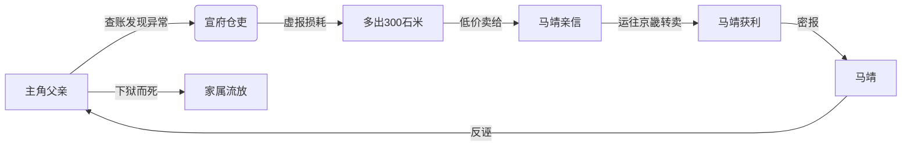

### 角色档案：马靖

> **姓名**：马靖 
> **生卒年**：不详，卒于永乐二十二年（1424年） 
> **官职**：内官监太监（正四品，宦官系统高阶） 
> **职责**：掌内府库藏、监仓、采办、织造 
> **历史出处**：《明太宗实录》卷二百七十三

---

#### 历史记载

> 《明太宗实录·永乐二十二年春正月》： 
> “内官监太监**马靖**，奉命巡视甘肃、宁夏等处。 
> 有言其**贪黩不法，私役军夫，侵盗官物**者。 
> 上命锦衣卫捕之，鞫实，伏诛。”

👉 **这是永乐朝唯一明确记载“因贪腐被处死”的高级宦官**。

---

#### 身份与权力

- **内官监太监**：明代宦官十二监之一，掌“宫室营造、器用采办、仓廪出纳”，权力极大；
- **监仓职责**：全国重要粮仓（包括边镇）的出入库，需经内官监派员稽查；
- **采办之权**：负责为宫廷采买物资，常借机敛财；
- **亲信身份**：曾受朱棣信任，派往西北巡视，代表“天子耳目”。

---

#### 艺术加工方向

我们可以设定：

- 马靖虽在京城，但通过**亲信太监（镇守宣府）** 和 **族人（仓吏）**，构建了一个**跨区域的贪腐网络**；
- 他在宣府的**远亲或家奴**担任仓吏，负责具体操作：虚报损耗、盗卖军粮、伪造账目；
- 主角父亲查账时，发现一笔“霉变米五百石”实为正常轮换，但**账面却多报“损耗八百石”**，多出三百石去向不明；
- 追查后发现，这批米被运往京畿，由马靖的亲信低价收购，转卖民间牟利；
- 他上报户部，副本落入镇守太监之手，后者立即密报马靖；
- 马靖反诬其“诽谤内臣，动摇边政”，并暗示其“勾结建文余党”；
- 朱棣震怒，命锦衣卫查办，主角父亲**死于狱中**；
- 不久后，马靖因在西北贪腐事发，被处死——**但无人知晓他在宣府的勾当**。

---

#### 为何选择马靖？

| 优势               | 说明                                           |
| ------------------ | ---------------------------------------------- |
| ✅ **真实存在**     | 唯一被《实录》记载“因贪腐被杀”的永乐宦官       |
| ✅ **职权匹配**     | 掌管“监仓”，可遥控边镇粮务                     |
| ✅ **道德标签清晰** | 史书明载“贪黩不法”，读者自然认定其为“坏人”     |
| ✅ **远离边将**     | 不牵连谭广等清廉将领，保护历史形象             |
| ✅ **悲剧性更强**   | 主角父亲为查一宦官远亲，竟遭灭门，凸显权宦之恶 |

---

#### 与主角父亲之死的关联链

